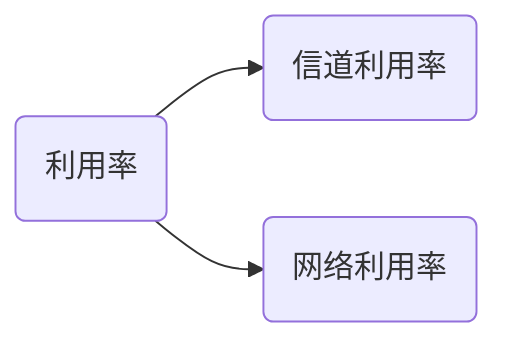

# 性能指标

### 1.速率

>   速率即数据传输率也称之为比特率，其单位有： b/s , kb/s , Mb/s , Gb/s , Tb/s

### 2.带宽

>   带宽用来表示网络的通信线路传送数据的能力，通常指单位时间内从网络中的某一点到另一点所能通过的“最高数据率”。单位是“比特/秒”。
>
>   >   例如： 1Mb/s 可以理解为1us内主机可以向通信链路发送1bit的数据。而2Mb/s则是说明主机在1us内可以同时向通信链路发送2bit的数据。

### 3.吞吐量

>   表示在单位时间内通过某个网络（或信道、接口）的数据量（简单说就是**每秒能够传送的数据量**）。吞吐量会受到网络的带宽或网络的额定速率的限制

a.瞬时吞吐量

​	在任何时间的瞬间主机接收文件的速率

b.平均吞吐量

### 4.时延类型

*   处理时延

    >   检查分组首部和决定将该分组导向何处所需要的时间

*   排队时延

    >   在队列中，当分组在链路上等待传输的时间

*   传输时延

    >   将所有分组推向链路所需要的时间

$$
传播时延 = \frac {信道长度} {电磁波在信道上的传播速率}
$$

*   传播时延

    >   从某一链路的一端到路由器之间路程中传播过程中所需要的时间
    
    $$
    传播时延 = \frac {数据长度} {信道宽度}
    $$
    

### 5.时延带宽积

时延带宽积又称之为以比特为单位的链路长度
$$
时延带宽积(bit) = 传播时延(s) \times 带宽(b/s)
$$

### 6.排队时延和丢包

#### 流量强度

$$
\frac {La}{R}
$$

​	其中 **a**表示分组到达队列的平均速率；R是传输速率，即队列中推出比特的速率；L表示的是每个分组的比特数。该公式计算出来的比率被称之为**流量强度**，这个速率在估计排队时延时具有着重要的作用。

#### 丢包

​	在流量强度接近于1的某一个程度时队列便会已满，这时到达的分组会无法被该路由器存储，那么路由器就会将该分组丢弃，即该分组丢失。分组的丢失的比例随着流量强度增加而增加。

### 7.往返时延（RTT）

从发送方发送数据开始，到发送方接收到的确认信息过程中所经历的总时延。

其定义为：该时间是指一个短分组从客户到服务器然后再返回客户所花费的时间。RTT包括分组传播时延、分组在中间路由器和交换机上的排队时延以及分组处理时延。[^1]

### 8.利用率

信道利用率 = $\frac{有数据通过时间} {有/无数据通过施加}$

网络利用率 ：  信道利用率加权平均值

[^1]:P66