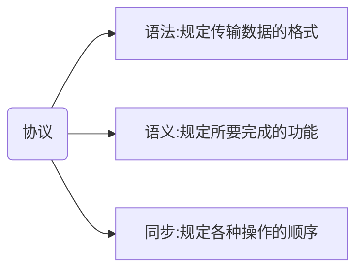
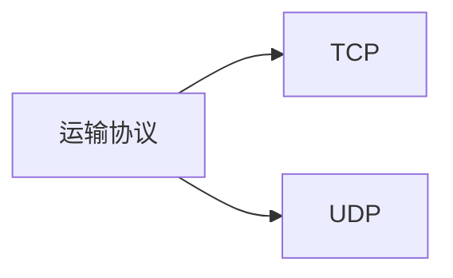
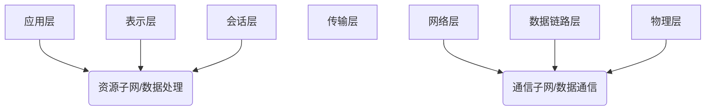
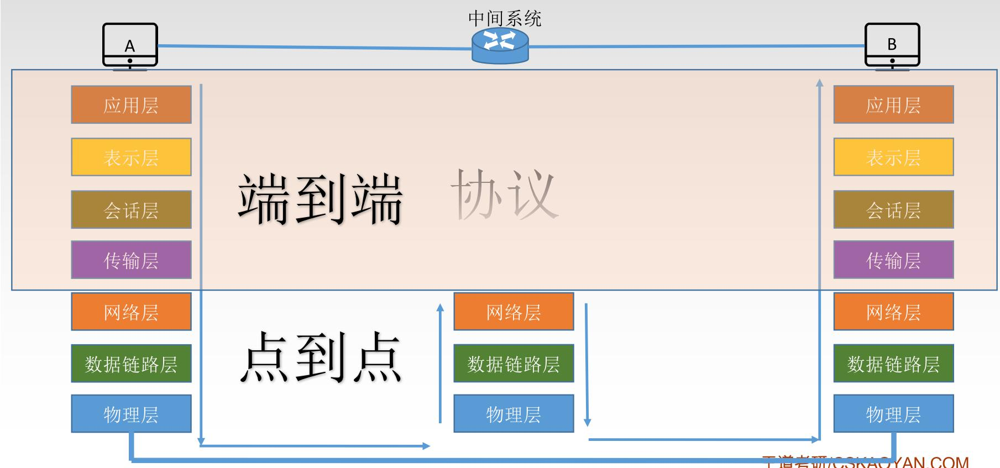
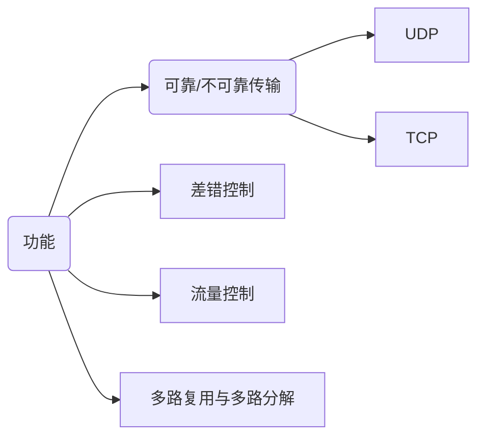
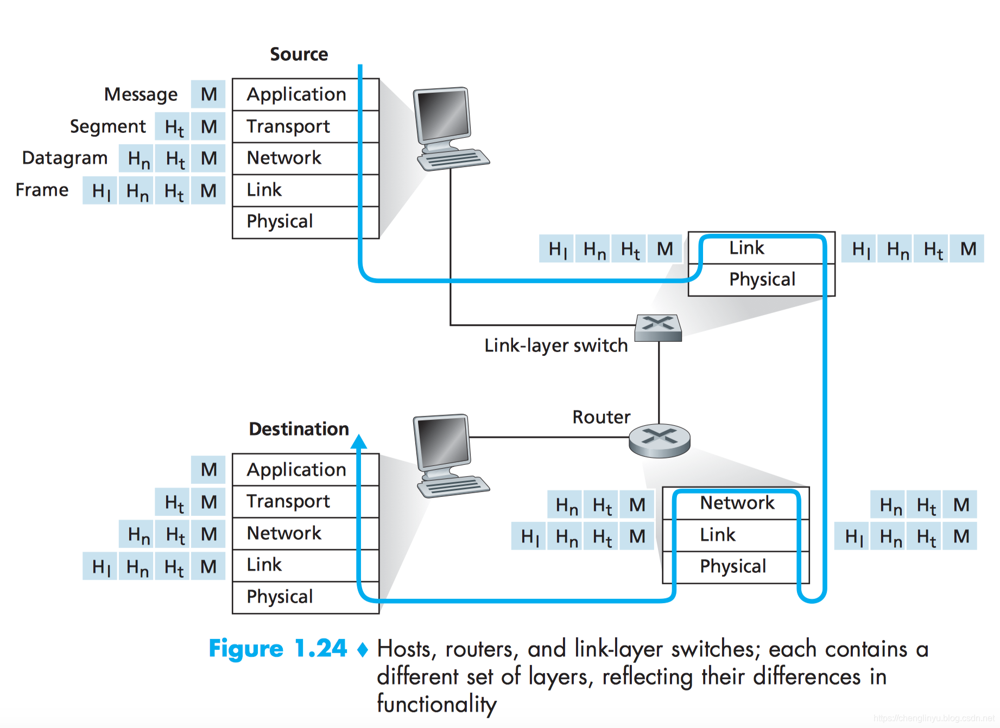

# 一、协议分层

 ## 1-1 基本原则

1.各层之间相互独立，每层只实现一种相对独立的功能。

2.每层之间界面自然清晰，易于理解，相互交流尽可能少。

3.结构上可分割开，每层都采用最合适的技术来实现。

4.保持下层对上层的独立性，上层单向使用下层提供的服务。

5.整个分层结构应该能促进标准化工作。


## 1-2 名词解释

（1）实体：在网络层次中第n层活动的元素称之为n层实体。而同一层的实体叫做对等实体。

（2）协议:为进行网络中的**对等实体**数据交换而建立的规则、标准或约定称为网络协议。



（3）接口（访问服务点SAP）： 上层使用下层服务的入口

（4）服务：下层为相邻上层提供的功能调用

（5）PDU

​	SDU服务数据单元：为完成用户所要求的功能而应传送的数据

​	PCI协议控制信息：控制协议操作的信息

​	PDU协议数据单元:对等层次之间传送的数据单位


（6）协议栈：各层的所有协议被称之为协议栈

（7）报文：位于应用层的信息分组被称之为报文

（8）报文段：运输层的分组称之为报文段

（9）帧：链路层的分组称之为帧


## 1-3 概念总结

*   网络体系结构是从功能上描述计算机网络结构。

*   计算机网络体系结构简称网络体系结构是分层结构。

*   每层遵循某个/些网络协议以完成本层功能。

*   第n层在向n+1层提供服务时，此服务不仅包含第n层本身的功能，还包含由下层服务提供的功能。

*   仅仅在相邻层间有接口，且所提供服务的具体实现细节对上一层完全屏蔽。

*   计算机网络体系结构是计算机网络的各层及其协议的集合

*   体系结构是抽象的，而实现是指能运行的一些软件和硬件

    ```mermaid
    graph LR
    A(分层结构)-->协议
    A-->服务
    A-->接口
    ```


## 1-4 因特网协议栈与OSI参考模型

### 1-4-1 因特网协议栈


（1）应用层：应用层是网络应用及它们的应用协议存留的地方

（2）运输层：运输层在应用程序端点之间传送应用层报文。



（3）网络层：网络层负责将称之为**数据报**的网络分层分组从一台主机移动到另一台主机

（4）链路层：在两个网络实体之间提供数据链路连接的创建、维持和释放管理。构成数据链路数据单元（frame：数据帧或帧），并对帧定界、同步、收发顺序的控制。传输过程中的网络流量控制、差错检测和差错控制等方面。

（5）物理层（实体层）：将链路层中的帧中的一个个比特从一个节点移动到下一个节点


### 1-4-2 OSI模型

20世纪70年代后，国际标准化组织（ISO）提出，称为开放系统互联（OSI）模型


其中：



#### 1-4-2-1 OSI参考模型通信过程




#### 1-4-2-2 OSI参考模型中7个层次的定义

##### 应用层

所有能和用户交互产生网络流量的程序（如果程序不需要联网，离线运行，那么该程序便不属于应用层的范畴）

##### 表示层

用于处理在两个通信系统中交换信息的表示方式(语法和语义)。

>   具体功能大概有：
>
>   1.  数据格式转换
>   2.  数据加密与解密
>   3.  数据的压缩与解压

##### 会话层

向表示层实体/用户进程提供建立连接并在连接上有序地传输数据。这是会话，也是建立同步(SYN)。

>   功能：
>
>   1.  建立、管理和终止会话
>
>   2.  建立使用校验点使会话可以在通信失效时从上一个校验点/同步点恢复通信，实现数据同步
>
>       例如：流式视频的断点播放

##### 运输层（传输层）

负责主机中两个进程的通信，即端到端的通信。传输单位是报文段或用户数据报。



##### 网络层(IP层)

主要任务是把分组从源端传到目的端，为分组交换网上的不同主机提供通信服务。网络层传输单位是数据报。

>   功能：
>
>   1.  路由选择
>   2.  流量控制
>   3.  差错控制
>   4.  拥塞控制

##### 数据链路层

主要任务是将网络层传递下来的数据报组装成帧

>   功能：
>
>   1.  封装为帧
>   2.  差错控制（帧错 + 位错）
>   3.  流量控制
>   4.  访问控制（对信道（通信链路）的访问控制）

##### 物理层

主要任务是在物理媒体上实现比特流的**透明传输**

>   功能：
>
>   1.  定义接口特性
>   2.  定义传输模式
>   3.  定义传输速率
>   4.  比特同步

# 二、封装

​	封装是指一个应用层报文在层层向下传输的过程中，每经过一层就会被附上一些附加信息，附加信息与上层报文构成一个新的报文段（根据所在不同的层名称也会不同），然后继续向下传递直到物理层进行传输。



<center>图1：封装与解包</center>

*链路层交换机最高到**链路层**；路由器最高到**网络层***

封装顺序为：


## 2-1 构成

在每一层，一个分组(packet)具有两种类型的字段：

1.  首部字段
2.  <font color=red>有效载荷字段</font>（该字段通常来自于上一层，即图1中的**M**）


## 2-2 封装内容

应用层报文->运输层报文：

1.  接收端传输层将报文向上交付到合适的应用时所需要的报文信息

2.  差错检测位信息（差错检测位能够允许接收端判断报文中的bit是否在传输的过程中被改变过）

    

运输层报文->网络层数据报：

1.  源和目的端系统地址等网络层首部信息


网络层数据报->链路层帧：

1.  链路层头部信息