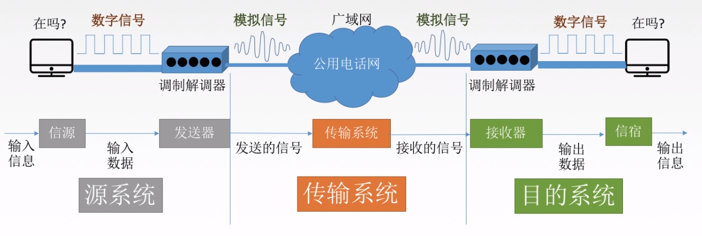
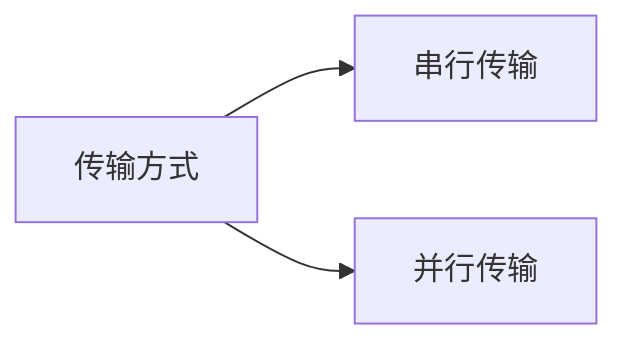
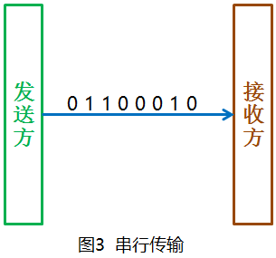
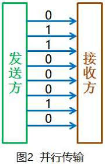
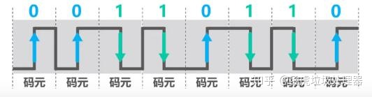
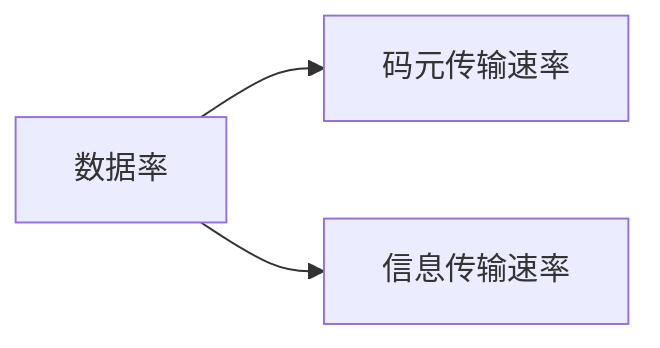
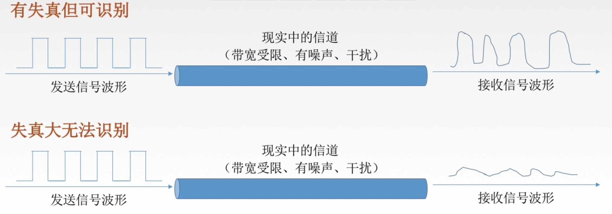
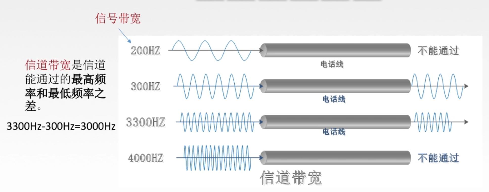

# 1、数据通信

## 1-1 数据通信过程

## 1-2 相关术语

**数据**:传送信息的实体，通常是有意义的符号序列。

**信号**:数据的电气/电磁的表现，是数据在传输过程中的存在形式。

*   数字信号：代表信息的参数取值是离散的

*   模拟信号：代表信息的参数取值是连续的

**信源**:产生和发送数据的源头。

**信宿**:接收数据的终点。

**信道**:信号的传输媒介。一般用来表示向某一个方向传送信息的介质，因此一条通信线路往往包含一条发送信道和一条接收信道。

## 1-3 三种通信方式

从通信的交互方式来分：

*   **单工通信**：只有一个方向的通信而没有反方向的交互，仅需要**一条**信道
*   **半双工通信**：通信的双方都可以发送或接收信息，但任何一方都不能同时发送和接收，需要**两条**信道
*   **全双工通信**：通信双方可以同时发送和接受信息，也需要**两条**信道。

## 1-4 两种数据传输方式

串行传输特点：

>   *   速度慢
>   *   费用低
>   *   适合远距离传输

并行传输特点：

>   *   速度快
>   *   费用高
>   *   适合近距离
>       *   例如：电脑上的并口

## 1-5 相关计算

### 名词解释

#### **码元**

指用一个固定时长的信号波形（数字脉冲），代表离散数值的基本波形。当有多个离散状态时，成为 M 进制码元。一个码元可以携带多个比特的信息。

#### **速率（数据率）**

指数据的传输速率，表示单位时间内传输的数据量

*   **码元传输速率**：表示单位时间内信号波形的**变换次数**，即通过信道传输的**码元个数**（也可称之为**脉冲个数**或者**信号变化的次数**），单位为**波特（Baud,B）**。码元速率也叫**波特率**，或称作调制速率、波形速率、符号速率。

>   1Baud = 1码元/s

TIP1：**一个码元可以携带多个比特的信息**，一个码元所包含的比特信息数与该信号的进制有关。例如一个二进制的电信号中一码元含有2比特信息；而一个4进制的电信号中一码元则含有4比特信息。

TIP2：单位 “波特” 本身就已经是代表每秒的调制数，以 “波特每秒”（Baud per second）为单位是一种常见的错误，但是在一般中文口语化的沟通上还是常以 “波特率” 来描述 “波特”（Baud）。

*   **信息传输速率**：表示单位时间内数字通信系统传输的**二进制码元**个数（即**比特数**），单位为比特/秒（b/s ， bps）。信息率也称**比特率**。

两者关系：若一个码元携带 n bit 的信息量，则 M Baud 的波特率所对应的比特率为 $M \times n $ bit/s

#### **带宽（频宽，信号宽度）**

​	表示在单位时间内从网络中的某一点到另一点所能通过的“最高数据率”，常用来表示网络的通信线路所能传输数据的能力。单位是b/s。

*   对于模拟信号而言，带宽又称为频宽，以赫兹（Hz）为单位
*   

### 波特率与比特率的关系

 $R_b = R_B \times log_2N$

R表示为变量；R~b~为比特率；R~B~为波特率；N为进制数

## 1-6 失真

影响失真的因素：

>   1.  码元传输速率
>   2.  信号传输距离
>   3.  噪声干扰
>   4.  传输媒体质量

#### 信道带宽

指信道能够通过的最高频率和最低频率之差

#### 码间串扰

​	直方脉冲的波形在时域内比较尖锐，因而在频域内占用的带宽是无限的。如果让这个脉冲经过一个低通滤波器，即让它的频率变窄，那么它在时域内就一定会变宽。因为脉冲是一个序列，这样相邻的脉冲间就会相互干扰

#### 奈氏准则

​	在理想低通（无噪声，带宽受限）条件下，为了避免码间串扰，极限码元传输速率为2W带宽，W是信道宽度，单位是Hz（只有在**奈氏准则**和**香农定理**这两个公式中带宽的单位才是**Hz**）。

*   在任何信道中，**码元传输的速率是有上限的**。若传输速率超过此上限，就会出现严重的码间串扰问题，使接收端对码元的完全正确识别成为不可能。
*   信道的**频带越宽**（即能通过的信号高频分量越多），就可以用更高的速率进行码元的有效传输。
*   奈氏准则给出了码元传输速率的限制，但并没有对信息传输速率给出限制。
*   由于码元的传输速率受奈氏准则的制约，所以要提高数据的传输速率，就必须设法使每个码元能携带更多个比特的信息量，这就需要采用多元制的调制方法。

公式：

$$理想低通信道下的极限数据传输率 = 2Wlog_2V (b/s)$$

>   *   W为“带宽（Hz）”
>
>   *   V为 “几种码元/码元的离散电平数目”

#### 香农定理

**噪声**：