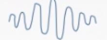
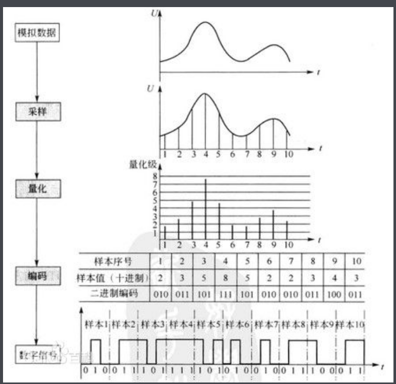
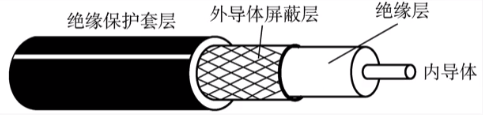

# 一、数据通信

## 1-1 数据通信过程

## 1-2 相关术语

**数据**:传送信息的实体，通常是有意义的符号序列。

**信号**:数据的电气/电磁的表现，是数据在传输过程中的存在形式。

*   数字信号：代表信息的参数取值是离散的

*   模拟信号：代表信息的参数取值是连续的

**信源**:产生和发送数据的源头。

**信宿**:接收数据的终点。

**信道**:信号的传输媒介。一般用来表示向某一个方向传送信息的介质，因此一条通信线路往往包含一条发送信道和一条接收信道。

## 1-3 三种通信方式

从通信的交互方式来分：

*   **单工通信**：只有一个方向的通信而没有反方向的交互，仅需要**一条**信道
*   **半双工通信**：通信的双方都可以发送或接收信息，但任何一方都不能同时发送和接收，需要**两条**信道
*   **全双工通信**：通信双方可以同时发送和接受信息，也需要**两条**信道。

## 1-4 两种数据传输方式

串行传输特点：

>   *   速度慢
>   *   费用低
>   *   适合远距离传输

并行传输特点：

>   *   速度快
>   *   费用高
>   *   适合近距离
>       *   例如：电脑上的并口

## 1-5 相关计算

### 1-5-1 名词解释

#### **码元**

指用一个固定时长的信号波形（数字脉冲），代表离散数值的基本波形。当有多个离散状态时，成为 M 进制码元。一个码元可以携带多个比特的信息。

#### **速率（数据率）**

指数据的传输速率，表示单位时间内传输的数据量

*   **码元传输速率**：表示单位时间内信号波形的**变换次数**，即通过信道传输的**码元个数**（也可称之为**脉冲个数**或者**信号变化的次数**），单位为**波特（Baud,B）**。码元速率也叫**波特率**，或称作调制速率、波形速率、符号速率。

>   1Baud = 1码元/s

TIP1：**一个码元可以携带多个比特的信息**，一个码元所包含的比特信息数与该信号的进制有关。例如一个二进制的电信号中一码元含有2比特信息；而一个4进制的电信号中一码元则含有4比特信息。

TIP2：单位 “波特” 本身就已经是代表每秒的调制数，以 “波特每秒”（Baud per second）为单位是一种常见的错误，但是在一般中文口语化的沟通上还是常以 “波特率” 来描述 “波特”（Baud）。

*   **信息传输速率**：表示单位时间内数字通信系统传输的**二进制码元**个数（即**比特数**），**单位为比特/秒（b/s ， bps）**。信息率也称**比特率**。

两者关系：若一个码元携带 n bit 的信息量，则 M Baud 的波特率所对应的比特率为 $M \times n $ bit/s

#### **带宽（频宽，信号宽度）**

​	表示在单位时间内从网络中的某一点到另一点所能通过的“最高数据率”，常用来表示网络的通信线路所能传输数据的能力。单位是b/s。

*   对于模拟信号而言，带宽又称为频宽，以赫兹（Hz）为单位

### 1-5-2 波特率与比特率（数据传输速率）的关系

 $R_b = R_B \times log_2N$

R表示为变量；**R~b~**为**比特率**；**R~B~**为**波特率**；N为**进制数**

## 1-6 失真

影响失真的因素：

>   1.  码元传输速率
>   2.  信号传输距离
>   3.  噪声干扰
>   4.  传输媒体质量

#### 信道带宽

指信道能够通过的最高频率和最低频率之差

#### 码间串扰

​	直方脉冲的波形在时域内比较尖锐，因而在频域内占用的带宽是无限的。如果让这个脉冲经过一个低通滤波器，即让它的频率变窄，那么它在时域内就一定会变宽。因为脉冲是一个序列，这样相邻的脉冲间就会相互干扰

## 1-6 奈氏准则（奈奎斯特定律）

​	在**理想**低通（无噪声，带宽受限）条件下，为了避免码间串扰，极限码元传输速率为2W带宽，W是信道宽度，单位是Hz（只有在**奈氏准则**和**香农定理**这两个公式中带宽的单位才是**Hz**）。

*   在任何信道中，**码元传输的速率是有上限的**。若传输速率超过此上限，就会出现严重的码间串扰问题，使接收端对码元的完全正确识别成为不可能。
*   信道的**频带越宽**（即能通过的信号高频分量越多），就可以用更高的速率进行码元的有效传输。
*   奈氏准则给出了码元传输速率的限制，但并没有对信息传输速率给出限制。
*   由于码元的传输速率受奈氏准则的制约，所以要提高数据的传输速率，就必须设法使每个码元能携带更多个比特的信息量，这就需要采用多元制的调制方法。

公式：

理想低通信道下的极限数据传输率 = 2W log~2~ V (b/s)

>   *   W为“带宽（Hz）”
>
>   *   V为 “几种码元/码元的离散电平数目”

## 1-7 香农定理

​	噪声存在于所有的电子设备和通信信道中。由于噪声随机产生，它的瞬时值有时会很大，因此噪声会使接收端对码元的判决产生错误。但是噪声的影响是相对的，若信号较强，那么噪声影响相对较小。因此，信噪比就很重要。**信噪比 = 信号的平均功率 / 噪声的平均功率**​，常记为S/N，并用分贝（dB）作为度量单位，即:

$$信噪比（dB） = 10lg(S/N)$$

​	香农定理定义了在带宽受限且**有噪声**的信道中，为了不产生误差，信息的数据传输的上限值。

> 1. 信道的**带宽**或信道中的**信噪比**越大，则信息的极限传输速率就**越高**
> 2. 对一定的传输宽带和一定的信噪比，信息传输速率的上限就确定了
> 3. 只要信息的传输速率低于信道的极限传输速率，就一定能找到某种方法来实现**无差错的传输**
> 4. 香农定理得出的为极限信息传输速率，实际信道能达到的传输速率要比它低不少 

## 1-8 总结

* 在奈氏准则中，想要提高数据率，要提高**带宽**或**采用更好的编码技术**
* 在香农定理中，想要提高数据率，要提高**带宽**或信**噪比**

# 二、编码与调制

## 编码

### 2-1 基带信号与宽带信号

**信道**：信号的传输媒介。一般用来表示向某一个方向传送信息的介质，因此一条通信线路往往包含一条发送信道和一条接收信道。

在传输距离较近时，计算机网络采用**基带传输**方式（近距离衰减小，从而信号内容不容易发生变化）

在远距离传输时，计算机网络采用**宽带传输**方式（远距离衰减大，即使信号变化大也能最后过滤出来基带信号）

### 2-2 编码与调制概念

*   数据转换为**数字信号**的过程称之为**编码**，数据转换为**模拟信号**的过程称之为**调制**。
*   数字数据通过**数字发送器**进行**编码**转换为**数字信号**；通过**调制器**进行**调制**转换为**模拟信号**。

*   模拟数据通过**PCM编码器**进行**编码**转换为**数字信号**；通过**放大器调制器**进行**调制**转换为**模拟信号**。

### 2-3 数字数据编码为数字信号的六种方式

#### （1）非归零编码【NRZ】

   * **高1低0**
   * 编码容易实现，但是没有检错功能，并且无法判断一个码元的开始和结束，以至于收发双方**难以保持同步**（需要额外的信道来确定信号周期）

#### （2）曼切斯特编码
   * 将一个码元分成两个相等的间隔，前一个间隔为低电平后一个间隔为高电平（**前低后高**）表示码元1；码元0则相反（**前高后低**）。也可以采用相反的规定
   
   * 特点为每一个码元的中间出现电平跳变，位中间的跳变不仅作为**时钟信号**（用于同步），又可以作为**数据信号**，但它所占的**频带宽度是原始的基带宽度的两倍**，所以**数据传输速率只有调制速率的$\frac {1}{2}$**
   
   * 曼切斯特编码在一个单位时间内信号会变化**两次**（脉冲个数为两个），第一次在开始位置，第二次在中间的位置
   
     
     
     

#### （3）差分曼切斯特编码

   * **同1，异0**

     1异：

     

     0同：

     

   * 常用于局域网传输，其规则是：若码元为1，则前半个码元的电平与上一个码元的后半个码元的电平相同，若为0，则相反

   * 特点是：在每个码元的**中间**，都有一次电平的跳转，可以实现**自同步**，且抗干扰性**强**于曼切斯特编码

#### （4）归零编码【RZ】

   * 信号电平在一个码元之内都要**恢复到零**的这种编码方式

#### （5）反向不归零编码【NRZI】

   * 信号电平**翻转**表示0，信号电平**不变**表示1（需要额外的信道来确定信号周期（**时钟周期**），不然在数据全1时无法识别）

#### （6）4B/5B编码

* 比特流中插入额外的比特以打破一连串的0或1数字数据，也就是说使用**五个比特**来编码**四个比特**的数据，然后再将编码后的信号传给接收方，因此称之为**4B/5B**。编码效率为普通编码方式的**80%**。

  > 正常来说，5比特可以表示32种状态$(2^5)$,但是这种编码方式**只采用了其中16种用于编码对应的16中不同状态的4位码**，而余下的16种作为控制码用于标记帧的**开始**、**结束**、**线路的状态信息**等）或者将其保留。

*4B/5B：*

## 调制

### 2-4 数字数据调制为模拟信号

​		数字数据调制技术在发送端将数字信号转换为模拟信号，而在接收端将模拟信号还原为数字信号，分别对应于调制解调器的调制过程和解调过程。

调制方式：

* ASK（调幅）

* FSK（调频）

* PSK（调相）

  

* QAM（调幅+调相 ， 正交振幅调制 ， Quadrature Amplitude Modulation）

### 2-5 模拟数据调制为数字信号

​		计算机内部处理的是二进制数据，处理的都是**数字音频**，所以需要将模拟音频通过采样、量化转换成有限个数字表示的离散序列（即实现**音频数字化**）。

#### 脉冲编码调制(PCM)

​		音频信号进行的**脉码调制**（脉冲编码调制 ，Pulse Code Modulation ，  **PCM**），其主要分为三步：

* 抽样
  * 对模拟信号周期性扫描，把时间上连续的信号变成时间上离散的信号
  * 为了使所得到的离散信号可以无失真地代表被抽样的模拟数据，需要遵循**采样定理**进行采样：$ f~采样频率~ \geq 2f~信号最高频率~ $（确保采样到正确的波形）
* 量化
  * 把抽样取得的电平幅值按照一定的分级标度转化为对应的数字值，并取整数，这就是把连续的电平幅值转换为离散的数字量
* 编码
  * 把量化的结果转换为与之对应的二进制编码

### 2-6 模拟数据调制为模拟信号

​		为了实现传输的有效性，可能需要较高的频率。这种调制方式还可以使用频分复用技术，充分利用带宽资源。在电话机和本地交换机所传输的信号是采用模拟信号传输模拟数据的方式;模拟的声音数据是加载到模拟的载波信号中传输的。

# 三、传输介质

​		传输介质也称之为媒体/传输媒体，它就是数据传输系统中在发送设备和接收设备之间的物理通路

​		**传输媒体并不是物理层**，传输媒体是在物理层之下，又因为物理层是体系结构的第一层，所以传输媒体有时也会被称之为**第零层**。

​		在传输媒体中传输的是信号，但传输媒体并不知道所传输的信号代表的是什么意思。而物理层规定了**电气特性**，因此能够识别所传输的比特流。

## 3-1 导向性介质

### 3-1-1 双绞线

​		双绞线是一种古老而常用的传输介质，它由**两根**采用一定规则并排**绞合**的、相互间绝缘的**铜导线**组成

>  **相互之间的绞合可以减少对相邻的导线的电磁干扰**，两条导线电流方向相反，产生的电磁波大小相等，之间相互抵消

​		在双绞线的外面再加一个由金属丝编制而成的屏蔽层，进一步加强抗电磁干扰的能力，这样的结构的双绞线称之为**屏蔽双绞线（STP）**，无屏蔽层的双绞线则称之为**非屏蔽双绞线（UTP）**。

UTP

STP

> 双绞线特点：
>
> * 价格便宜
> * 模拟传输和数字传输都可以进行传输
> * 通信距离一般为几公里到数十公里
> * 距离太远时，对于**模拟传输**，需要使用**放大器**放大衰减的信号；对于**数字传输**，要用**中继器**将失真的信号整形

***

### 3-1-2 同轴电缆

​		同轴电缆由**导体铜质芯线**、**绝缘层**、**网状编织屏蔽层**和**塑料外层**构成。按特性阻抗数值的不同，通常将同轴电缆分为两类:**$50\Omega$同轴电缆**和**$75\Omega$同轴电缆**。

其中:

​		$50\Omega$同轴电缆主要**用于传送基带数字信号**，又称为**基带同轴电缆**，它在局域网中得到广泛应用.

​		$75\Omega$同轴电缆主要**用于传送宽带信号**，又称为**宽带同轴电缆**，它主要用于有线电视系统。

***

同轴电缆

***

### 3-1-3 光纤

​		光纤通信就是利用**光导纤维**〈简称光纤）传递光脉冲来进行通信。有光脉冲表示1，无光脉冲表示0。而可见光的频率大约是$10^8$MHz，因此光纤通信系统的**带宽远远大于**目前其他各种传输媒体的带宽。

> 光纤在发送端有光源，可以采用**发光二极管**或**半导体激光器**，它们在电脉冲作用下能产生出光脉冲;在接收端用光电二极管做成光检测器，在检测到光脉冲时可还原出电脉冲。

光纤主要由**纤芯**(实心)和**包层**构成，光波通过纤芯进行传导，包层较纤芯有较低的折射率。当光线从高折射率的介质射向低折射率的介质时，其折射角将大于入射角。因此，如果入射角足够大，就会出现全反射，即光线碰到包层时候就会折射回纤芯、这个过程不断重复，光也就沿着光纤传输下去。

***

#### 光纤分类

* 多模光纤

  * 定义：有**多种**传输光信号模式的光纤
  * 光源：发光二极管
  * 特点：损耗小（衰减小），适合远距离传输

  

* 单模光纤
  * 定义：一种在**横向模式**直接传输光信号的光纤
  * 光源：**定向性**很好的**激光二极管**
  * 特点：易失真，适合近距离传输

***

光纤

#### 总结

光纤的特点：

* 传输损耗小，中继距离长，对远距离传输特别经济
* 抗雷电和电磁干扰性能好
* 无串音干扰，保密性好，也不易被窃听或截取数据
* 体积小，重量轻

***

## 3-2 非导向性传输介质

### 3-2-1 分类

* 无线电波
  * 信号向所有方向传播
  * 穿透能力强，可远距离传播，广泛应用于通信领域
* 微波
  * 信号向固定方向传播
  * 微波通信频率较高、频段范围宽，因此数据率很高
* 红外线、激光
  * 信号向固定方向传播
  * 把要传输的信号分别转换为各自的信号格式（即红外光信号和激光信号）再在空间中传播

> 卫星通信的优缺点
>
> 优点：
>
> * 通信容量大
> * 距离远
> * 覆盖广
> * 广播通信和多址通信
>
> 缺点：
>
> * 传播时间长（250ms~270ms）
> * 受气候影响大
> * 误码率较高
> * 成本高

# 四、物理层设备

## 中继器

​		由于在传输过程中存在损耗，在线路上传输的信号功率会逐渐衰减，衰减到一定程度时将造成信号失真，这将会导致在接收端接收时产生错误或无法识别信号的情况。

**功能**：

* 对信号进行**再生和还原**，对衰减的信号进行放大，保持与原始数据相同，以增加信号传输的距离，延长网络的长度

中继器

**中继器的两端**：两端的网络部分是网段，而不是**子网**，适用于完全相同的**两类**网络的互联，且两个网段速率要相同

> 中继器只是将任何电缆段上的数据发送到另一端电缆上，它仅仅作用于信号的电器部分，并不管数据是否有错或不适于网段的数据

​		在中继器的两端可以连接相同的媒体，也可以连接不同的媒体。

**5-4-3**规则：指在 **10M/s** 以太网中，网络总长度不得超过 **5 个区段**，4 台网络延长设备（**中继器**），且 5 个区段中只有 **3 个区段可接网络设备**。

5-4-3

## 集线器（多口中继器）

​		对信号进行再生**放大转发**，对衰减的信号进行放大，接着转发到其他所有（处输入端口外）处于工作装状态的端口上，以增加信号传输的距离，延长网络的长度。不具备信号的定向传输能力，集线器属于一种共享式设备。

集线器

> 集线器不能分割冲突域，所以连接在集线器是上的工作主机平分带宽

