# 一、链路层的基本概念

## 1-1 名词解释

**结点**：指的是主机和路由器

**链路**：网络中两个**结点**之间的**物理通道**，链路的传输介质主要包含双绞线、光纤、微波等等。主要分为有线链路和无线链路。

**数据链路**：网络中两个结点之间的**逻辑通道**，把实现控制数据**协议**的硬件和软件添加到链路上，便一同构成数据链路。

**帧**：链路层的协议数据单元，即在链路层上所封装网络层数据报后的数据单元

## 1-2 功能

​		数据链路层在物理层提供服务的基础上**向网络层提供服务**，其最基本的服务是将源自网络层来的数据可靠地传输到相邻节点的目标机网络层。其主要作用是**加强物理层传输原始比特流的功能**，将物理层提供的可能出错的物理连接改造成为**逻辑上无差错的数据链路**，使之对网络层表现为一条无差错的链路。

> 功能：
>
> * 为网络层提供服务
>   * 无确认无连接服务
>   * 有确认无连接服务
>   * 有确认面向连接服务
> * 链路管理，进行连接的建立、维持和释放（用于面向连接的服务）
> * 组帧
> * 流量控制
> * 差错控制（帧错/位错）

# 二、封装成帧\透明传输

## 2-1 帧概念

**封装成帧**就是在一段数据的前后部分添加首部和尾部，这样就构成了一个帧。

> 接收端在收到物理层上交的比特流后，就能根据首部和尾部的标记，从收到的比特流中识别帧的开始和结束。首部和尾部包含许多的控制信息，他们的一个重要作用:帧定界（确定帧的界限）。

**帧同步**:接收方应当能从接收到的二进制比特流中区分出帧的起始和终止。

**组帧的四种方法**：

1. 字符计数法
2. 字符（节）填充法
3. 零比特填充法
4. 违规编码法

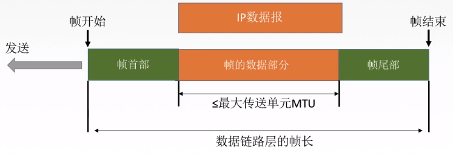

帧

## 2-2 透明传输概念

**透明传输**：指不管所传数据是什么样的比特组合，都应该能够在链路上传送。因此，链路层就“看不见”有什么可以妨碍数据传输的东西。

当所传数据中的比特组合恰巧与某一个控制信息完全一样时，就必须采取适当的措施，使接收方不会将这样的数据误认为是某种控制信息。这样才能保证数据链路层的传输是透明的。

> 透明传输就是在传输过程中，对外界透明，就是说你看不见他是传送网络，不管传输的业务如何，我只负责将需要传送的业务传送到目的节点，同时保证传输的质量即可，而不对传输的业务进行处理
>
> 透明传输不用关心下层协议的传输，比如你要寄信，只需要写地址交给邮局就行了，然后对方就能收到你的信，但是中途经过多少车站，火车，邮递员，你根本不知道，所以对于你来说邮递的过程是透明的

## 2-3 组帧方式

### （1）字符计数法

帧首部使用一个计数字段（第一个**字节**，八位）来表明帧内字符数

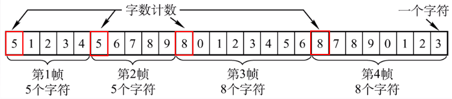

> 缺点：
>
> * 易出错

### （2）字符填充法

**情况一**：当传送的帧是由文本文件组成时（键盘输入的ASCII码），无论从键盘上输入什么字符都可以放入帧中，即**透明传输**

**情况二**：当传送的帧是由非ASCII码的文本组成时（如二进制的程序或图像），那么需要**采用字符填充方法实现透明传输**

> 当前缺点：
>
> 若在传输过程中，读取到的帧中间的数据部分的内容中有一部分数据与EOT相同，那么就会导致错误的识别边界

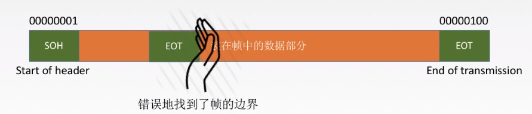

**解决方式 – 字符填充**：

在原始数据中的与控制信息相同的部分前面进行字符填充（转义字符，8bit），在接收后再将填充的字符去掉

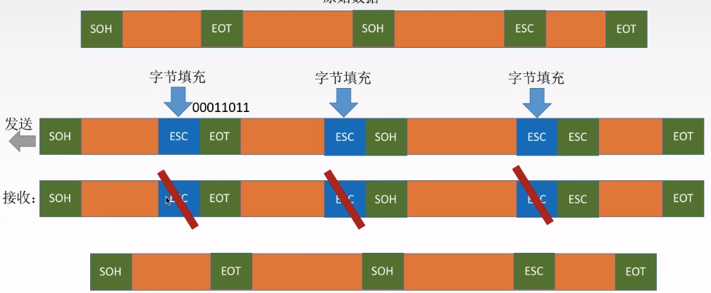

### （3）零比特填充法（常用）

* 发送端 ： **5“1”1“0”**，即在原始数据中遇到5个连续的1时，便会在其后面插入一个0

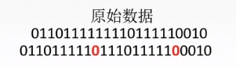

* 接收端：在接收端收到一个帧时，先找到标志字段确定边界，再使用硬件对比特流进行扫描。当发现5个连续的“1”时，便会将其后面的一个”0“删除

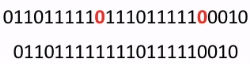

> 保证了透明传输，在传输的比特流中可以传输任意组合的比特组合，而不会引起对帧边界的错误判断

### （4）违规编码法（常用）

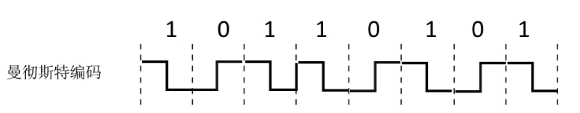

因为在曼切斯特编码中，电平的正确数据表示方式只有两种

* 高-低
* 低-高

所以违规编码方式便是使用“高 - 高”或“低 - 低”来定界帧的起始和终止

# 三、差错控制

## 3-1 差错的产生

* 全局性：由于线路本身电气特性所产生的随机噪声（热噪声），是信道所固有的，随机存在的。

  > 解决：提高信噪比从而减少或避免干扰（对传感器进行改造）

* 局部性：外界特定、短暂的原因所造成的冲击噪声，是产生差错的主要原因

  > 解决：通常利用编码技术进行解决

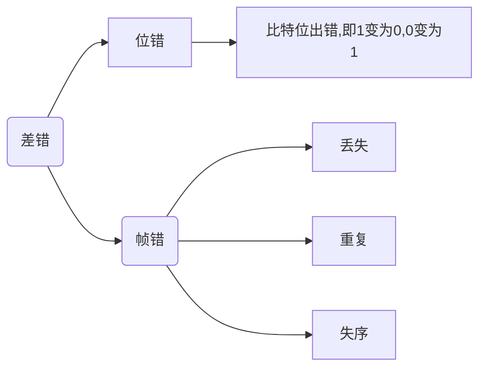

> 在通信质量好的有线传输链路中，链路层为网络层提供的是**无确认无连接服务**。
>
> 在通信质量差的无线传输链路中，链路层为网络层提供的是**有确认无连接服务**或**有确认面向连接服务**。

## 3-2 数据链路层的差错控制

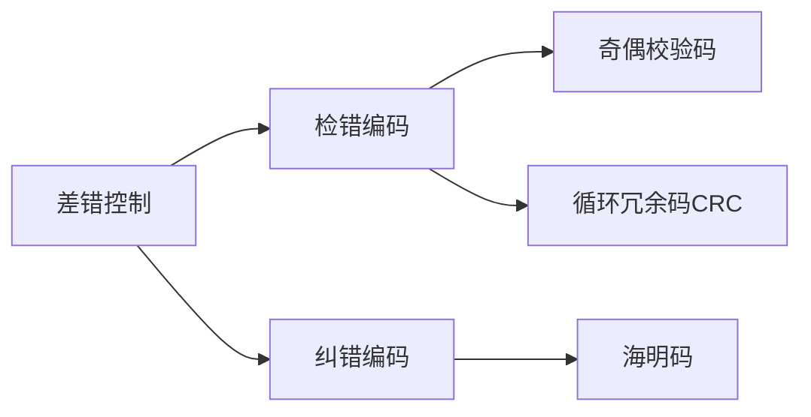

**物理层**编码与**链路层**编码区别：

数据链路层与物理层的**数据编码**与**调制**不同。

物理层编码针对的是**单个的比特**，为的是解决传输过程中**同步**之类的问题，例如**曼切斯特编码**。

而数据链路层的编码是针对**一组比特**，它是通过**冗余码**的技术实现一组二进制比特串在传输过程中检查是否出了差错。

**纠错码**

> 纠错码 (error correcting code)，在传输过程中发生错误后能在收端自行发现或纠正的码。仅用来发现错误的码一般常称为检错码。为使一种码具有检错或纠错能力，须对原码字增加多余的码元，以扩大码字之间的差别 ，即把原码字按某种规则变成有一定剩余度（见信源编码）的码字，并使每个码字的码之间有一定的关系。关系的建立称为编码。码字到达收端后，可以根据编码规则是否满足以判定有无错误。当不能满足时，按一定规则确定错误所在位置并予以纠正。纠错并恢复原码字的过程称为译码。检错码与其他手段结合使用，可以纠错。

**冗余码**

> 冗余码是一种所用符号数或信号码元数比表示信息所必需的数目多的代码，应用了冗余加密技术，即利用了纠错码的编码原理，在加密的文件中加入了大量的冗余信息，从而达到加密的目的。（也可以用于纠错）

### 3-2-1 检错编码 - 奇偶校验码

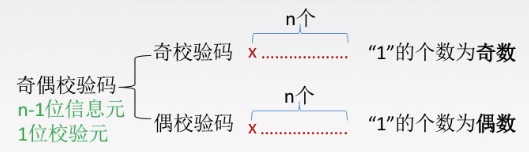

**特点**：

* 只能检查出**奇数个比特**的错误，检查出错误的概率为50%

如：

​	11100110 –> 11100111（可以检测出）

​	11100110 –> 11100101（无法检测出）

### 3-2-2 检错编码 - CRC循环冗余码

**计算冗余码**

$ （要传的数据） \div （生成多项式） = （FCS帧检验序列/冗余码）$

**最终发送的数据**

要发送的数据 + 帧检验序列FCS

例如：

发送端发送数据“5”：

​	$ 5 \div 2 = 1$

1为FCS帧检验序列

最终发送的数据为：5 + 1 = 6

接收端，接收到数据“6”：

$ 6 \div 2 = 3 $

余数为0，接收数据

**计算冗余码过程**：

1. 加0，加的0的个数与生成多项式G(x)的阶相同，假设生成多项式的阶为n，那么便是加n个0
2. 模2除法；数据加0之后**除以多项式，余数为冗余码**（FCS/CRC检验码）的比特序列

> 多项式N位，阶为N-1位（二进制）

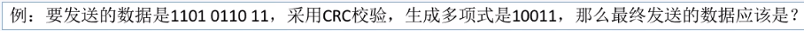

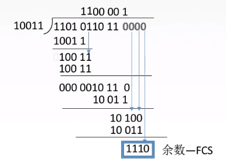

到达接收端后：

把接收到的每一个帧都除以同样的除数，然后检查得到的余数R

* 余数为0，则说明这个帧没有错，接收该帧
* 余数为1，说明该帧出现差错（无法确定错误到位），丢弃该帧

> FCS的生成和处理都是由**硬件**进行实现，所以处理十分迅速，不会延误数据的传输

​		在数据链路层仅仅使用循环冗余检验CRC差错检测技术，只能做到对帧的无差错接收，即“凡是接收端数据链路层接受的帧，我们都能以非常**接近于1**的概率认为这些帧在传输过程中没有产生差错”。接收端丢弃的帧虽然曾收到了，但是最终还是因为有差错被丢弃。“凡是接收端数据链路层接收的帧均无差错”。

> 注意：链路层使用CRC检验，能够实现无比特差错的传输，但并达不到可靠传输（因为在接收过程中可能会将一些帧丢弃）

### 3-2-3 纠错编码 - 海明码（hamming code）

特点：

* 能够发现双比特错误，但只能够纠正单比特错误

工作流程

#### 确定校验码位数r

**海明不等式**

$ 2^r \ge k + r + 1 $

r为冗余信息位；k为信息位

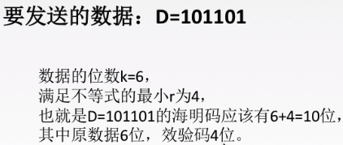

#### 确定校验码位置和数据位置

假设4位校验码分别为P~1~、P~2~、P~3~、P~4~；数据从左向右为D~1~、D~2~、D~3~…

> 校验码只能够放在2的N次方的位置，而数据则是从左至右“填空”

| 数据位 |  1   |  2   |  3   |  4   |  5   |  6   |  7   |  8   |  9   |  10  |
| :----: | :--: | :--: | :--: | :--: | :--: | :--: | :--: | :--: | :--: | :--: |
|  代码  | P~1~ | P~2~ | D~1~ | P~3~ | D~2~ | D~3~ | D~4~ | P~4~ | D~5~ | D~6~ |
| 实际值 |      |      |  1   |      |  0   |  1   |  1   |      |  0   |  1   |

#### 求出校验码的值

校验码是P~n~，则该校验码可以校验的数据为数据中序列对应二进制数的第n位的数字与校验码所在序列对应的二进制数的第n位相同的数据；

例如：P~1~，对应的二进制序列为“0001”，可知 n = 1 ，则可以校验的数据为序列二进制数第一位为“1”的数据，即数据位“1”、“3”、“5”、“7”、“9”的数据

| 二进制 |             0001             |             0010             | 0011 |             0100             | 0101 | 0110 | 0111 |             1000             | 1001 | 1010 |
| :----: | :--------------------------: | :--------------------------: | :--: | :--------------------------: | :--: | :--: | :--: | :--------------------------: | :--: | :--: |
| 数据位 |              1               |              2               |  3   |              4               |  5   |  6   |  7   |              8               |  9   |  10  |
|  代码  | P~1~  | P~2~  | D~1~ | P~3~  | D~2~ | D~3~ | D~4~ | P~4~  | D~5~ | D~6~ |
| 实际值 |   0   |   0   |  1   |   0   |  0   |  1   |  1   |   1   |  0   |  1   |

求取校验码的方式为**校验码令所有要校验的位异或（符号：$\oplus$）为0**

如：

$ P_1 \oplus D_1 \oplus D_2 \oplus D_4 \oplus D_5 = 0$

即

$ P_1 \oplus 1 \oplus 0 \oplus 1 \oplus 0 = 0 $

可得**P~1~ = 0**  

#### 检错与纠错

由上面可得**101101**的海明码为**0010011101**

检错即令所有要检验的位进行异或运算。

例：

假设第五位出错,0–>1

| 二进制 |             0001             |             0010             | 0011 |             0100             |            0101            | 0110 | 0111 |             1000             | 1001 | 1010 |
| :----: | :--------------------------: | :--------------------------: | :--: | :--------------------------: | :------------------------: | :--: | :--: | :--------------------------: | :--: | :--: |
| 数据位 |              1               |              2               |  3   |              4               |             5              |  6   |  7   |              8               |  9   |  10  |
|  代码  | P~1~  | P~2~  | D~1~ | P~3~  |            D~2~            | D~3~ | D~4~ | P~4~  | D~5~ | D~6~ |
| 实际值 |   0   |   0   |  1   |   0   | 1 |  1   |  1   |   1   |  0   |  1   |

P~1~运算得出1，P~2~运算得出0，P~3~运算的出1，P~4~运算的出0，即可以知道错误位置出现在0101（P~1~为最低位），也就是第五位数据。

在得到错误位置后，将该位的数据改为相对应的反码，即完成了纠错的过程。

# 四、流量控制与可靠传输

​	**较高的发送速度**和**较低的接收能力**不匹配，会造成传输出错，因此流量控制也属于数据链路层的一项重要的工作。

**数据链路层和传输层的流量控制的不同**：

* 数据链路层
  * 数据链路层的流量控制是**点对点**的
  * 控制手段为：接收方收不下就**不回复确认**

* 传输层
  * 传输层的流量控制是**端到端**的

  * 控制手段为：接收端给发送端一个**窗口公告**

## 4-1 控制流量的方法

* 1 比特滑动窗口协议
* 滑动窗口协议

### 4-1-1 停止等待协议（1 比特滑动窗口协议）

​	即每发送一个帧就停止发送，等待对方的确认信息，在收到确认信息后再发送下一个帧

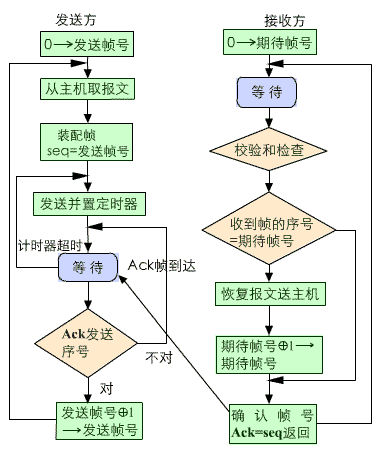

流程描述

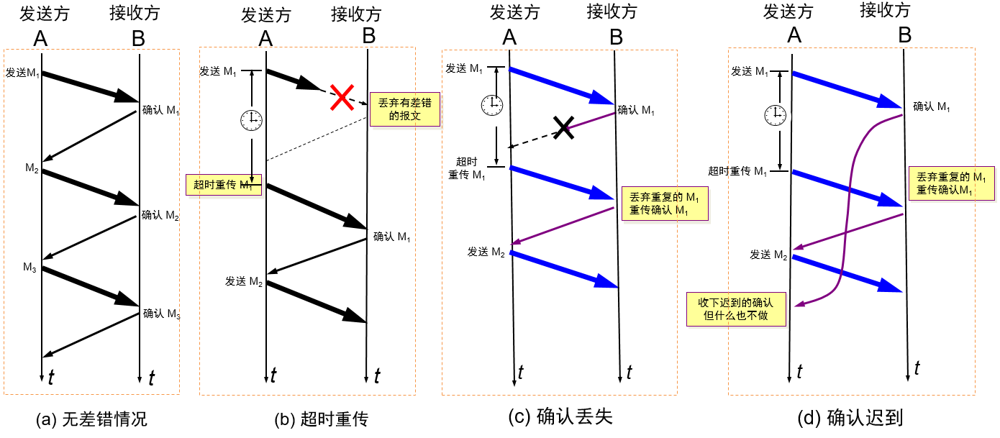

各种情况下的处理

> 这时接受方的窗口和发送方的窗口大小都是 1，1 个比特就够表示了，所以也叫 **1 比特滑动窗口协议**。发送方这时自然发送每次只能发送一个，并且必须等待这个数据包的 **ACK（确认帧）**，才能发送下一个。虽然在效率上比较低，带宽利用率明显较低，不过在网络环境较差，或是带宽本身很低的情况下，还是适用的。
>
> 存在的问题是，当发送方交替发送标记为 “奇数” 和 “偶数” 的数据包。 发送的确认同样为 “奇数” 和 “偶数”。 假设已经发送了奇数分组的发送方没有收到奇数确认，而是立即发送下一个偶数分组，在此之后它可能会收到一个确认，为 “下一个奇数包”。这将使发送方出现不确定因素：接收方有可能接收到这两个数据包，或者两者都没接收到。

注意：

* 发送完一个帧后，会保留该帧的副本
* 数据帧和确认帧（ACK）必须编号（将数据包分为**奇数包**和**偶数包**进行交互）

**缺点**：

​		信道利用率太低

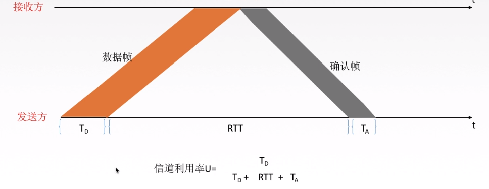

大部分时间都在传输过程中

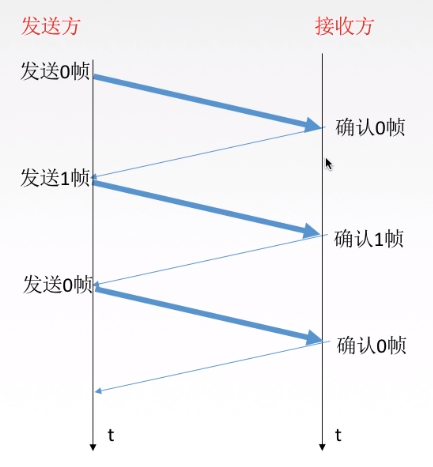

**发送方在一个发送周期内，有效地发送数据所需要的时间占整个发送周期的比率**

$$信道利用率 = \frac {(\frac LC)}{T}$$

* L为T发送L比特数据

* T为发送周期
* C为发送方数据传输率

$$信道吞吐率 = 信道利用率 \times 发送方的发送速率$$

***

### 4-1-2 滑动窗口协议（sliding-window protocol）

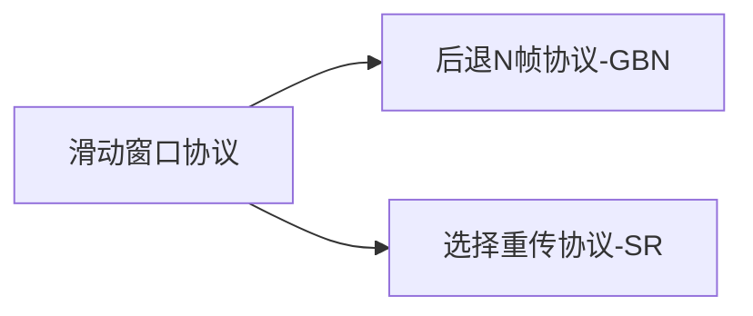

​	滑动窗口协议（Sliding Window Protocol），属于 TCP 协议的一种应用，用于网络数据传输时的流量控制，以避免拥塞的发生。该协议允许发送方在停止并等待确认前发送多个数据分组。由于发送方不必每发一个分组就停下来等待确认。因此该协议可以加速数据的传输，提高网络吞吐量。

***

#### GBN —— 后退N帧协议

##### （1）简介

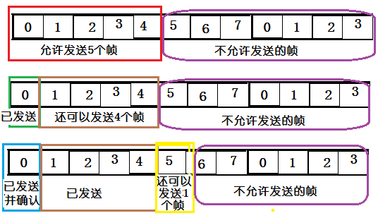

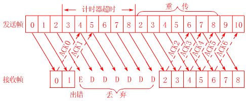

> 由于停止等待协议效率太低，因此有了回退 n - 步协议，这也是滑动窗口协议真正的用处，这里发送的窗口大小为 n，接受方的窗口仍然为 1。具体看下面的图，这里假设 n=10： 首先发送方一口气发送 9 个数据帧，前面两个帧正确返回了，数据帧 2 出现了错误，这时发送方被迫重新发送 2-8 这 7 个帧，接受方也必须丢弃之前接受的 3-8 这几个帧。 后退 n 协议的好处无疑是提高了效率，但是一旦网络情况糟糕，则会导致大量数据重发，反而不如上面的停等协议。
>
> 存在的问题在于，假设我们使用 3 位序列号，这是 HDLC 的典型值。 这使得 $N = 2^3$
>
>  = 8。 由于 wr = 1，我们必须限制 wt≤7。 这是因为在发送 7 个数据包之后，有 8 个可能的结果：0 到 7 个数据包都可能被成功地接收。 这有 8 种可能性，发送方在确认中需要足够的信息来区分它们。如果发送方发送 8 个数据包而不等待确认，则可能会发现自己存在和停止等待协议一样的问题：这意味着所有 8 个数据包都可能被成功接收，亦或是一个都没有被成功接收。

**详解**

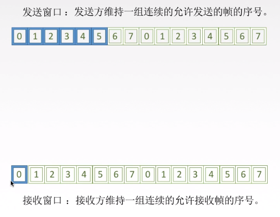

* 在后退N帧协议中，发送方可以拥有窗口可以包括多个帧（size $\ge1$），而接收窗口只能有一个(size = 1)

##### （2）**工作原理**

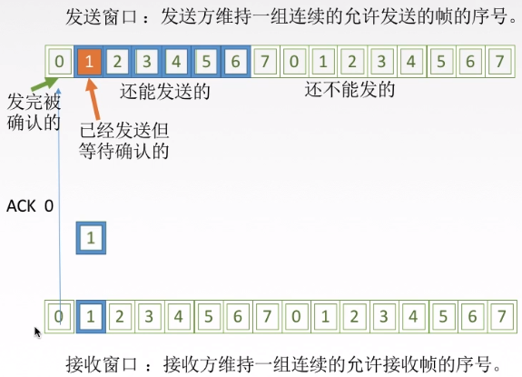

(1)

**发送方**

​	发送方在发送完第一个窗口中的帧后会继续发送窗口中下一个帧。最多能将窗口中有的帧进行发送，而窗口后面的数据帧是无法发送的。

> 如图：当前链路层最多能够发送的数据帧为0~5，而后面的6、7、0…都无法发送，直到当前的窗口向后滑动到新的位置

​	在发送方发送完0号帧后，会对该帧进行一次缓存备份，然后等待接收方返回的**ACK0**（0号帧的确认信息），并从该时刻起（0号帧发送完成时）启动一个超时计时器（计时时长大于RTT），其后会有两种情况：

* 收到来自接收方的ACK0，那么发送方的窗口将向后移动一个帧位（0~5帧 ->  1~6帧）

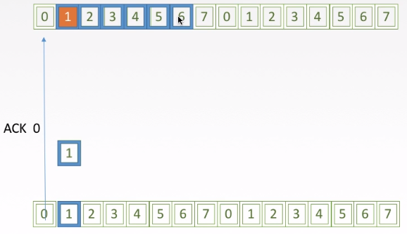

* 没有收到来自接收方的ACK0，引发该情况有两种可能：
  * **数据帧在路上丢失** ， 这时会导致超时计时器超时，那么发送方会自动的将窗口中的该帧（0号帧）以及其后面的帧重新发送（1、2、3、4、5）
  *  **ACK0在路上丢失** ，这种情况发送方会超时计时器超时后根据返回的ACK序列号，取其中最大的序号进行确认（即看最大的序号）
  
  > 如：发送 0~7 编号的帧，计时器超时后，接收方只收到了0、2、3号帧的确认，那么发送发将会重传 4~7号帧（3号帧确认，表明0、1、2、3号帧全部正确接收）

**接收方**

​	接收方会维持一组连续的允许接收帧的序号

* 如果正确接收到N号帧，并且**按序**，那么接收方会为N号帧发送一个ACK，并将该帧中的数据交付给上层，随后将窗口向后移动
* 在所有其他情况下，接收方将**丢弃**该分组，并**为最近按序接收的分组重新发送**。ACK接收方无需缓存任何**失序**的帧，只需要维护一个信息：expectedseqnum（下一个按序接收的帧序号）

> 例：
>
> 发送方会连续的发送一组帧，如发送**0、1、2、3、4**，但在传输过程中其中间某一个帧丢失了，如：**0、1、3、4**，2号帧丢失了，那么接收方只会正确的接收**0、1**号帧，而将**3、4**号帧则会被丢弃，等待2号帧的接收（因为当前接收方的窗口停留在2号帧的位置，窗口后面的数据是不会被正确接收的）

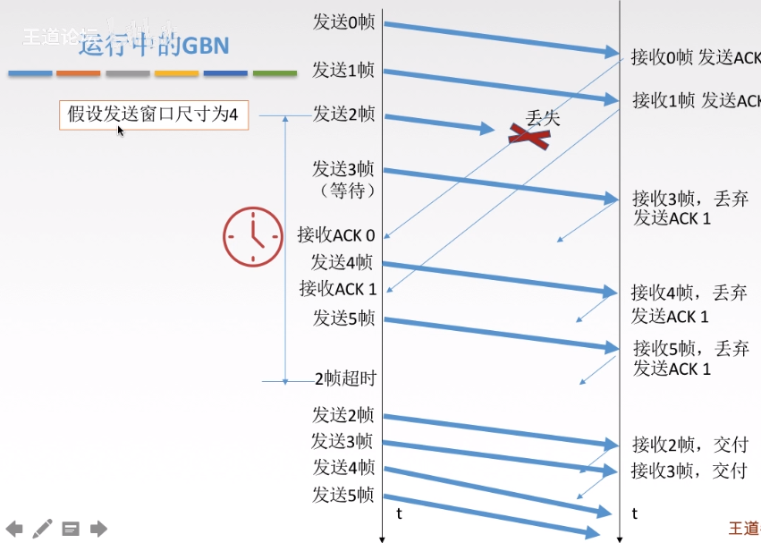

工作流程

##### （3）**GBN发送方必须响应的三件事**

* 上层的调用

  * 上层要发送数据时，发送方先检查发送窗口是否已满，如果未满，则产生一个帧并将其发送;如果窗口已满
    发送方只需将数据返回给上层，表示上层窗口己满。上层等一会再发送。(实际实现中，发送方可以缓存这
    些数据，窗口不满时再发送帧）。

* 收到了一个ACK

  * GBN协议中，对N号帧的确认采用的是**累计确认**的方式，表名接收方已经收到的N号帧和它之前的所有帧。

* 超时事件

  * 协议的名字为后退N帧/回退N帧，来源于出现丢失和时延过长帧时发送方的行为。就像在停等协议中一样，
    定时器将再次用于恢复数据帧或确认帧的丢失。如果出现超时，发送方重传所有已发送但未被确认的帧。

##### （4）滑动窗口长度限制

若采用n个比特对帧进行编号，那么发送窗口的尺寸$W_T$应该满足：$1 \le W_T \le 2^n-1$。

原因：若发送的窗口过大，会使得接收方在某些情况下无法判断是新帧还是重传的旧帧

##### （5）总结

优点：连续发送帧提高了信道利用率

缺点：重传的机制导致在某些时候传输的效率非常低（批量重传）

***

#### SR —— 选择重传协议

##### （1）简介

> 后退 n 协议的另外一个问题是，当有错误帧出现后，总是要重发该帧之后的所有帧，毫无疑问在网络不是很好的情况下会进一步恶化网络状况。
>
> 重传协议便是用来解决这个问题。原理也很简单，接收端总会缓存所有收到的帧，当某个帧出现错误时，只会要求重传这一个帧，只有当某个序号后的所有帧都正确收到后，才会一起提交给高层应用。重传协议的缺点在于接受端需要更多的缓存。

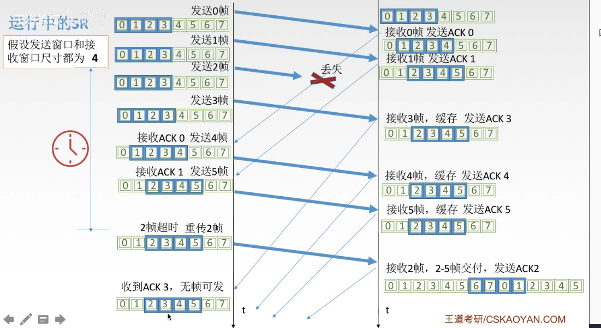

工作流程

##### （2）工作原理

**发送方**

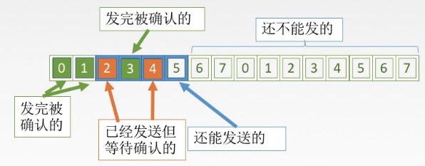

**接收方**

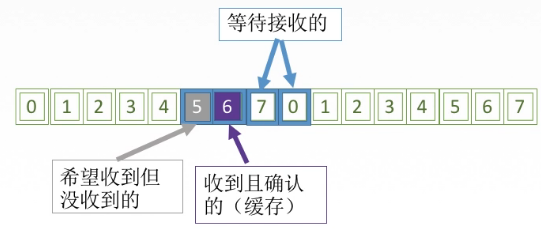

* 来者不拒
  * SR接收方将确认一个正确接收的帧而不管其是否按序。失序的帧将被缓存，并返回给发送方一个该帧的确认帧【收谁确认谁】，直到所有帧（即序号更小的帧）皆被收到为止，这时才可以将一批帧按序交付给上层（网络层），然后向前移动滑动窗口。

> 即：当前窗口接收4~7帧，5号帧先到，那么会先将5号帧存入缓存，等待成功接收到4号帧后再读入5号帧

* 如果收到了窗口序号外（小于窗口下界）的帧，就会返回一个该帧的ACK
  * 这种情况可能是之前发送的该帧的ACK在传输过程中丢失，导致发送方没有收到确认信息，超时计时器超时，继而发送方认为该帧没有正确到达接收方而又发了一遍
  * 其他情况则是忽略该帧

##### （3）SR发送方必须响应的三件事

* 上层的调用
  * 从上层收到数据后，SR发送方检查下一个可用于该帧的序号，如果序号位于发送窗口内，则发送数据帧，否
    则就像GBN一样，要么将数据缓存，要么返回给上层之后再传输。
* 收到了一个ACK
  * 如果收到ACK，加入该帧序号在窗口内，则SR发送方将那个被确认的帧标记为已接收。如果该帧序号是窗口
    的下界(最左边第一个窗口对应的序号），则窗口向前移动到具有**最小序号的未确认帧处**。如果窗口移动了
    并且有序号在窗口内的未发送帧，则发送这些帧。

例如：

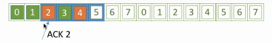

收到ACK2

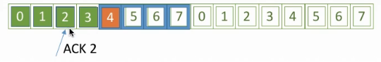

滑动窗口

* 超时事件
  * 每个帧都有自己的定时器，一个超时事件发生后只重传一个帧

##### （4）滑动窗口的长度

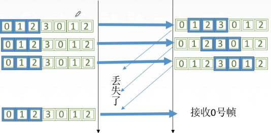

情况1

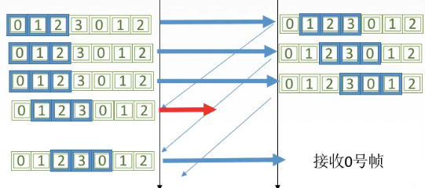

情况2

在第一种情况下，链路层能够是正确的识别0号帧，但是在第二种情况下，链路层就无法正确的识别0号帧了，无法分辨其是新发过来的下一组编号中的0号帧还是上一组编号中重传的0号帧（可能为ACK丢失后重传的）

* CR协议中，发送窗口大小最好等于接收窗口大小

窗口大小：$ W_{Tmax} = W_{Rmax} = 2^{n-1} $

>  T表示发送方窗口大小，R表示接收方窗口大小

##### （5）总结

* 对数据帧逐个确认，收到哪一个就确认哪一个
* 只重传出错的帧
* 接收方具有缓存，可以缓存失序的帧，待收到与其连续的帧后再读入

***

### 4-1-3 各协议发送/接收的窗口大小

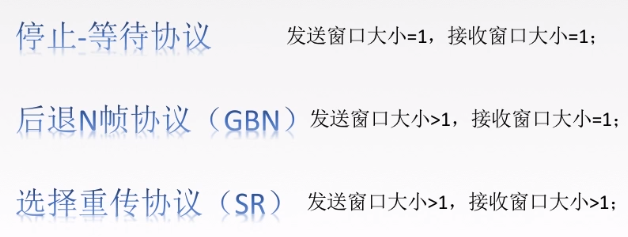

***

## 4-2 可靠传输、滑动窗口与流量控制概念

**可靠传输**

> 发送的什么，接收到的就是什么

**流量控制**

> 控制发送的速率，使接收方有足够的缓存空间来接收每一个帧

**滑动窗口**

> 用于解决流量控制与可靠传输（发送方在一定时间内未收到确认回复，就会自动重传）的问题的协议

# 五、信道划分介质访问控制

## 5-1 传输使用的两种链路

**点对点链路**：两个相邻节点通过一个链路相连，没有第三者。

> 如：PPP协议

**广播式链路**：所有主机共享通信介质

> 如：无线局域网、早期的总线以太网
>
> 典型拓扑结构：总线型、星型（逻辑上的总线型）

## 5-2 介质访问控制

**介质访问控制**的内容为，采取一定的措施，使得两对节点之间的通信不会发生互相干扰的情况。

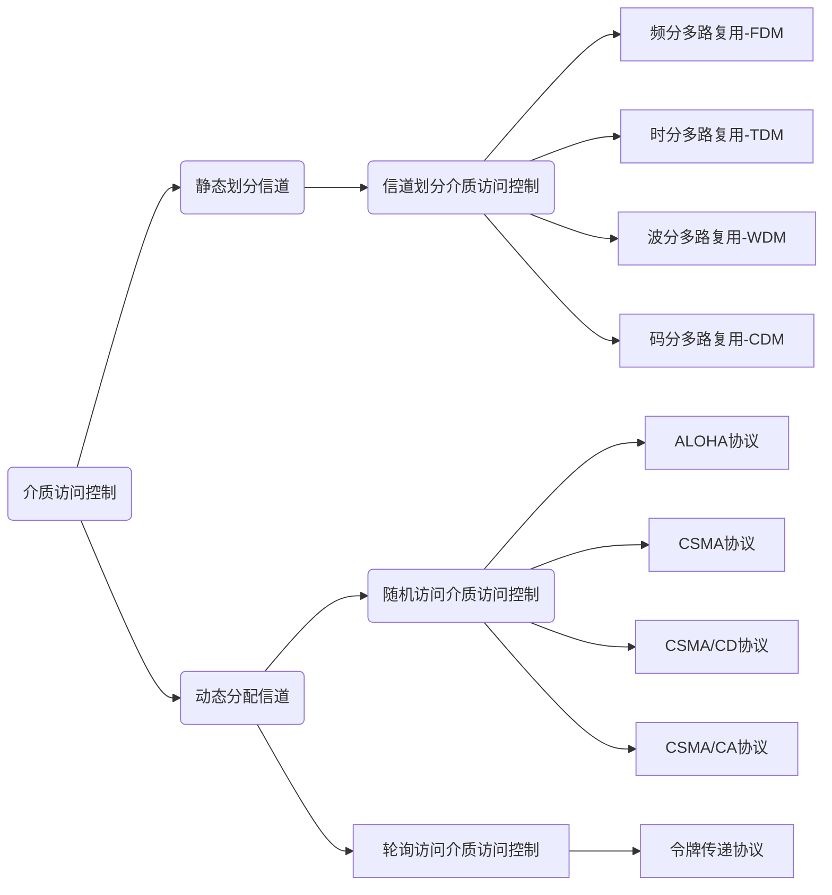

### 信道划分介质访问控制

**信道划分介质访问控制**:将使用介质的每个设备与来自同一信道上的其他设备的通信隔离开，把时域和
频域资源合理地分配给网络上的设备。

**多路复用技术**：把多个信道组合在一个物理信道上进传输，使得多个计算机或终端设备共享信道资源，提高信道利用率。

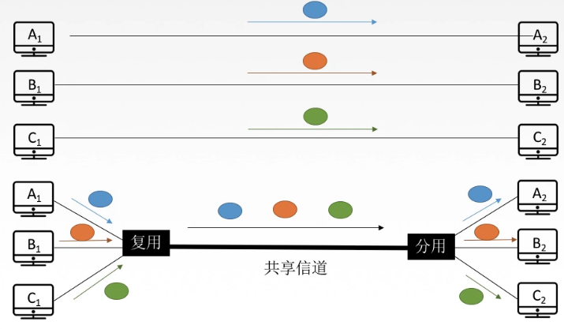

> 将一条广播信道，逻辑上分成几条用于两个节点之间通信的互不干扰的子信道，实际就是把广播信道在逻辑上变为点对点的信道。

#### （1）FDM

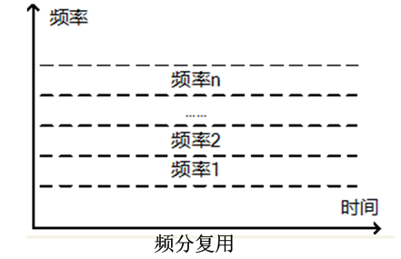

用户在分配到一定的频带后，在通信过程中自始至终都占用这个频带。频分复用的所有用户在同样的时间占用不同的带宽（频率带宽）资源。

特点：

* 充分利用传输介质带宽，系统**效率较高**
* 技术比较成熟，实现比较容易

#### （2）TDM

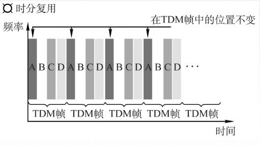

将时间划分为一段等长的时分复用帧（TDM帧）。每一个时分复用的用户在每一个TDM帧中占用**固定序号的时隙**，所有用户轮流占用信道，构成周期性。

注意：TDM帧是在物理层传送的比特流所划分的帧，标志着一个周期（时间片）

#### （3）统计时分复用（STDM）

​	STDM（statistical time division multiplexing）是TDM的改进

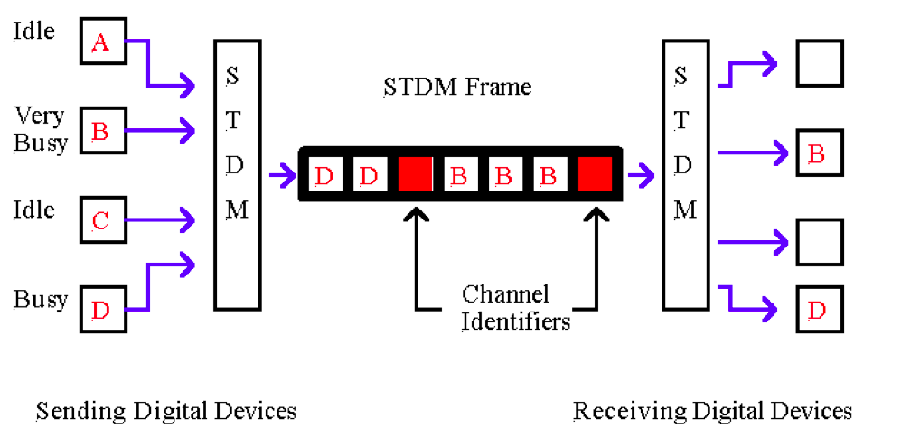

每一个STDM帧中的时隙数小于连接在**集中器**上的用户数。各用户有了数据就随时发往集中器的输入缓存，然后集中器按顺序依次扫描输入缓存，把缓存中的输入数据放入STDM帧中，一个STDM帧满了就发出。STDM帧不是固定分配时隙，而是按需动态分配时隙。

优点：在时分多路复用（TDM）系统中，共用信道数据率为各低速终端数据率之和。而在 STDM 系统中，各终端数据率之和高于共用信道的数据率，传输效率可提高 2～4 倍

> 假设有4个用户，共用一个通信信道，信道最大传送速率为8000bit/s，其中A用户和B用户使用较为频繁，而C和D用户则发送的信息量较少比较空闲，那么TDM的问题就在于平均将信道的传输速率分配给这四个用户，即每人2000bit/s，那么会造成C和D用户对信道的利用率低。而STDM则采用的是动态分配，根据用户所传输的数据量来**动态调整信道**的分配量。
>
> 例如，在BCD用户没有发送数据时，此时A用户在发送大型文件，则会给A用户分配全额传输速率，即8000bit/s；这里若是使用TDM，则传输速率最大也只有2000bit/s

#### （4）WDM

波分多路复用就是**光的频分多路复用**，在一根光纤中传输多种不同波长（频率）的光信号，由于波长（频率)不同，所以各路光信号互不干扰，最后再用波长分解复用器将各路波长分解出来。

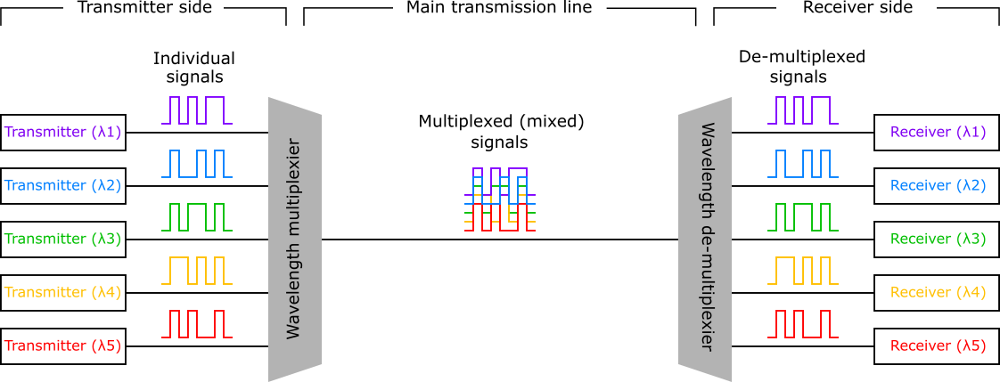

> Wavelength multiplexier 合波器

#### （5）CDM

**码分多址**（CDMA）：是码分复用的一种方式

码分多路复用 CDM 又称码分多址（Code Division Multiple Access,CDMA）,CDM 与 FDM（频分多路复用）和 TDM（时分多路复用）不同，它既共享信道的频率，也共享时间，是一种真正的动态复用技术。其原理是每比特时间被分成 m 个更短的时间槽，称为码片（Chip）, 通常情况下每比特有 64 或 128 个码片。每个站点 (通道) 被指定一个唯一的 m 位的代码或码片序列。当发送 1 时站点就发送码片序列，发送 0 时就发送码片序列的反码。当两个或多个站点同时发送时，各路数据在信道中被线形相加。为了从信道中分离出各路信号，要求各个站点的码片序列是相互正交的。

