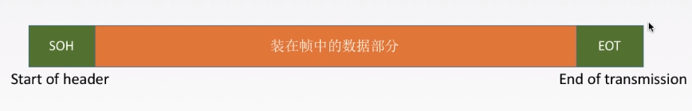
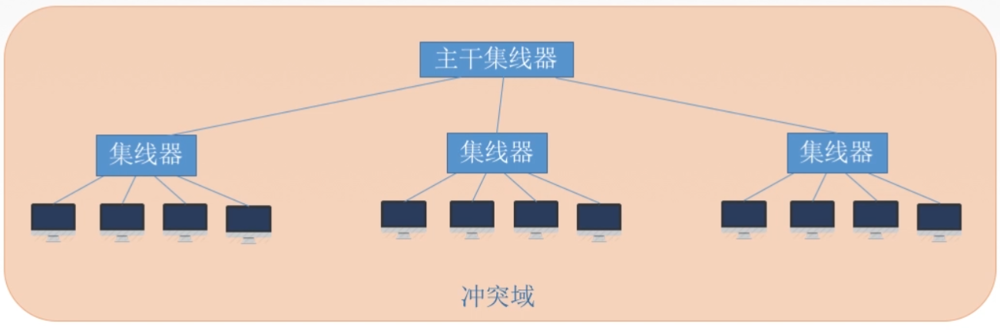

# 一、链路层的基本概念

## 1-1 名词解释

**结点**：指的是主机和路由器

**链路**：网络中两个**结点**之间的**物理通道**，链路的传输介质主要包含双绞线、光纤、微波等等。主要分为有线链路和无线链路。

**数据链路**：网络中两个结点之间的**逻辑通道**，把实现控制数据**协议**的硬件和软件添加到链路上，便一同构成数据链路。

**帧**：链路层的协议数据单元，即在链路层上所封装网络层数据报后的数据单元

## 1-2 功能

​		数据链路层在物理层提供服务的基础上**向网络层提供服务**，其最基本的服务是将源自网络层来的数据可靠地传输到相邻节点的目标机网络层。其主要作用是**加强物理层传输原始比特流的功能**，将物理层提供的可能出错的物理连接改造成为**逻辑上无差错的数据链路**，使之对网络层表现为一条无差错的链路。

> 功能：
>
> * 为网络层提供服务
>   * 无确认无连接服务
>   * 有确认无连接服务
>   * 有确认面向连接服务
> * 链路管理，进行连接的建立、维持和释放（用于面向连接的服务）
> * 组帧
> * 流量控制
> * 差错控制（帧错/位错）

# 二、封装成帧与透明传输

## 2-1 帧概念

**封装成帧**就是在一段数据的前后部分添加首部和尾部，这样就构成了一个帧。

> 接收端在收到物理层上交的比特流后，就能根据首部和尾部的标记，从收到的比特流中识别帧的开始和结束。首部和尾部包含许多的控制信息，他们的一个重要作用:帧定界（确定帧的界限）。

**帧同步**:接收方应当能从接收到的二进制比特流中区分出帧的起始和终止。

**组帧的四种方法**：

1. 字符计数法
2. 字符（节）填充法
3. 零比特填充法
4. 违规编码法

帧

## 2-2 透明传输概念

**透明传输**：指不管所传数据是什么样的比特组合，都应该能够在链路上传送。因此，链路层就“看不见”有什么可以妨碍数据传输的东西。

当所传数据中的比特组合恰巧与某一个控制信息完全一样时，就必须采取适当的措施，使接收方不会将这样的数据误认为是某种控制信息。这样才能保证数据链路层的传输是透明的。

> 透明传输就是在传输过程中，对外界透明，就是说你看不见他是传送网络，不管传输的业务如何，我只负责将需要传送的业务传送到目的节点，同时保证传输的质量即可，而不对传输的业务进行处理
>
> 透明传输不用关心下层协议的传输，比如你要寄信，只需要写地址交给邮局就行了，然后对方就能收到你的信，但是中途经过多少车站，火车，邮递员，你根本不知道，所以对于你来说邮递的过程是透明的

## 2-3 组帧方式

### （1）字符计数法

帧首部使用一个计数字段（第一个**字节**，八位）来表明帧内字符数

> 缺点：
>
> * 易出错

### （2）字符填充法

**情况一**：当传送的帧是由文本文件组成时（键盘输入的ASCII码），无论从键盘上输入什么字符都可以放入帧中，即**透明传输**

**情况二**：当传送的帧是由非ASCII码的文本组成时（如二进制的程序或图像），那么需要**采用字符填充方法实现透明传输**

> 当前缺点：
>
> 若在传输过程中，读取到的帧中间的数据部分的内容中有一部分数据与EOT相同，那么就会导致错误的识别边界

**解决方式 – 字符填充**：

在原始数据中的与控制信息相同的部分前面进行字符填充（转义字符，8bit），在接收后再将填充的字符去掉

### （3）零比特填充法（常用）

* 发送端 ： **5“1”1“0”**，即在原始数据中遇到5个连续的1时，便会在其后面插入一个0

* 接收端：在接收端收到一个帧时，先找到标志字段确定边界，再使用硬件对比特流进行扫描。当发现5个连续的“1”时，便会将其后面的一个”0“删除

> 保证了透明传输，在传输的比特流中可以传输任意组合的比特组合，而不会引起对帧边界的错误判断

### （4）违规编码法（常用）

因为在曼切斯特编码中，电平的正确数据表示方式只有两种

* 高-低
* 低-高

所以违规编码方式便是使用“高 - 高”或“低 - 低”来定界帧的起始和终止

# 三、差错控制

## 3-1 差错的产生

* 全局性：由于线路本身电气特性所产生的随机噪声（热噪声），是信道所固有的，随机存在的。

  > 解决：提高信噪比从而减少或避免干扰（对传感器进行改造）

* 局部性：外界特定、短暂的原因所造成的冲击噪声，是产生差错的主要原因

  > 解决：通常利用编码技术进行解决

> 在通信质量好的有线传输链路中，链路层为网络层提供的是**无确认无连接服务**。
>
> 在通信质量差的无线传输链路中，链路层为网络层提供的是**有确认无连接服务**或**有确认面向连接服务**。

## 3-2 数据链路层的差错控制

**物理层**编码与**链路层**编码区别：

数据链路层与物理层的**数据编码**与**调制**不同。

物理层编码针对的是**单个的比特**，为的是解决传输过程中**同步**之类的问题，例如**曼切斯特编码**。

而数据链路层的编码是针对**一组比特**，它是通过**冗余码**的技术实现一组二进制比特串在传输过程中检查是否出了差错。

**纠错码**

> 纠错码 (error correcting code)，在传输过程中发生错误后能在收端自行发现或纠正的码。仅用来发现错误的码一般常称为检错码。为使一种码具有检错或纠错能力，须对原码字增加多余的码元，以扩大码字之间的差别 ，即把原码字按某种规则变成有一定剩余度（见信源编码）的码字，并使每个码字的码之间有一定的关系。关系的建立称为编码。码字到达收端后，可以根据编码规则是否满足以判定有无错误。当不能满足时，按一定规则确定错误所在位置并予以纠正。纠错并恢复原码字的过程称为译码。检错码与其他手段结合使用，可以纠错。

**冗余码**

> 冗余码是一种所用符号数或信号码元数比表示信息所必需的数目多的代码，应用了冗余加密技术，即利用了纠错码的编码原理，在加密的文件中加入了大量的冗余信息，从而达到加密的目的。（也可以用于纠错）

### 3-2-1 检错编码 - 奇偶校验码

**特点**：

* 只能检查出**奇数个比特**的错误，检查出错误的概率为50%

如：

​	11100110 –> 11100111（可以检测出）

​	11100110 –> 11100101（无法检测出）

### 3-2-2 检错编码 - CRC循环冗余码

**计算冗余码**

$ （要传的数据） \div （生成多项式） = （FCS帧检验序列/冗余码）$

**最终发送的数据**

要发送的数据 + 帧检验序列FCS

例如：

发送端发送数据“5”：

​	$ 5 \div 2 = 1$

1为FCS帧检验序列

最终发送的数据为：5 + 1 = 6

接收端，接收到数据“6”：

$ 6 \div 2 = 3 $

余数为0，接收数据

**计算冗余码过程**：

1. 加0，加的0的个数与生成多项式G(x)的阶相同，假设生成多项式的阶为n，那么便是加n个0
2. 模2除法；数据加0之后**除以多项式，余数为冗余码**（FCS/CRC检验码）的比特序列

> 多项式N位，阶为N-1位（二进制）

到达接收端后：

把接收到的每一个帧都除以同样的除数，然后检查得到的余数R

* 余数为0，则说明这个帧没有错，接收该帧
* 余数为1，说明该帧出现差错（无法确定错误到位），丢弃该帧

> FCS的生成和处理都是由**硬件**进行实现，所以处理十分迅速，不会延误数据的传输

​		在数据链路层仅仅使用循环冗余检验CRC差错检测技术，只能做到对帧的无差错接收，即“凡是接收端数据链路层接受的帧，我们都能以非常**接近于1**的概率认为这些帧在传输过程中没有产生差错”。接收端丢弃的帧虽然曾收到了，但是最终还是因为有差错被丢弃。“凡是接收端数据链路层接收的帧均无差错”。

> 注意：链路层使用CRC检验，能够实现无比特差错的传输，但并达不到可靠传输（因为在接收过程中可能会将一些帧丢弃）

### 3-2-3 纠错编码 - 海明码（hamming code）

特点：

* 能够发现双比特错误，但只能够纠正单比特错误

工作流程

#### （1）确定校验码位数r

**海明不等式**

$ 2^r \ge k + r + 1 $

r为冗余信息位；k为信息位

#### （2）确定校验码位置和数据位置

假设4位校验码分别为P~1~、P~2~、P~3~、P~4~；数据从左向右为D~1~、D~2~、D~3~…

> 校验码只能够放在2的N次方的位置，而数据则是从左至右“填空”

| 数据位 |  1   |  2   |  3   |  4   |  5   |  6   |  7   |  8   |  9   |  10  |
| :----: | :--: | :--: | :--: | :--: | :--: | :--: | :--: | :--: | :--: | :--: |
|  代码  | P~1~ | P~2~ | D~1~ | P~3~ | D~2~ | D~3~ | D~4~ | P~4~ | D~5~ | D~6~ |
| 实际值 |      |      |  1   |      |  0   |  1   |  1   |      |  0   |  1   |

#### （3）求出校验码的值

校验码是P~n~，则该校验码可以校验的数据为数据中序列对应二进制数的第n位的数字与校验码所在序列对应的二进制数的第n位相同的数据；

例如：P~1~，对应的二进制序列为“0001”，可知 n = 1 ，则可以校验的数据为序列二进制数第一位为“1”的数据，即数据位“1”、“3”、“5”、“7”、“9”的数据

| 二进制 |             0001             |             0010             | 0011 |             0100             | 0101 | 0110 | 0111 |             1000             | 1001 | 1010 |
| :----: | :--------------------------: | :--------------------------: | :--: | :--------------------------: | :--: | :--: | :--: | :--------------------------: | :--: | :--: |
| 数据位 |              1               |              2               |  3   |              4               |  5   |  6   |  7   |              8               |  9   |  10  |
|  代码  | P~1~  | P~2~  | D~1~ | P~3~  | D~2~ | D~3~ | D~4~ | P~4~  | D~5~ | D~6~ |
| 实际值 |   0   |   0   |  1   |   0   |  0   |  1   |  1   |   1   |  0   |  1   |

求取校验码的方式为**校验码令所有要校验的位异或（符号：$\oplus$）为0**

如：

$ P_1 \oplus D_1 \oplus D_2 \oplus D_4 \oplus D_5 = 0$

即

$ P_1 \oplus 1 \oplus 0 \oplus 1 \oplus 0 = 0 $

可得**P~1~ = 0**  

#### （4）检错与纠错

由上面可得**101101**的海明码为**0010011101**

检错即令所有要检验的位进行异或运算。

例：

假设第五位出错,0–>1

| 二进制 |             0001             |             0010             | 0011 |             0100             |            0101            | 0110 | 0111 |             1000             | 1001 | 1010 |
| :----: | :--------------------------: | :--------------------------: | :--: | :--------------------------: | :------------------------: | :--: | :--: | :--------------------------: | :--: | :--: |
| 数据位 |              1               |              2               |  3   |              4               |             5              |  6   |  7   |              8               |  9   |  10  |
|  代码  | P~1~  | P~2~  | D~1~ | P~3~  |            D~2~            | D~3~ | D~4~ | P~4~  | D~5~ | D~6~ |
| 实际值 |   0   |   0   |  1   |   0   | 1 |  1   |  1   |   1   |  0   |  1   |

P~1~运算得出1，P~2~运算得出0，P~3~运算的出1，P~4~运算的出0，即可以知道错误位置出现在0101（P~1~为最低位），也就是第五位数据。

在得到错误位置后，将该位的数据改为相对应的反码，即完成了纠错的过程。

# 四、流量控制与可靠传输

​	**较高的发送速度**和**较低的接收能力**不匹配，会造成传输出错，因此流量控制也属于数据链路层的一项重要的工作。

**数据链路层和传输层的流量控制的不同**：

* 数据链路层
  * 数据链路层的流量控制是**点对点**的
  * 控制手段为：接收方收不下就**不回复确认**

* 传输层
  * 传输层的流量控制是**端到端**的

  * 控制手段为：接收端给发送端一个**窗口公告**

## 4-1 控制流量的方法

* 1 比特滑动窗口协议
* 滑动窗口协议

### 4-1-1 停止等待协议（1 比特滑动窗口协议）

​	即每发送一个帧就停止发送，等待对方的确认信息，在收到确认信息后再发送下一个帧

流程描述

各种情况下的处理

> 这时接受方的窗口和发送方的窗口大小都是 1，1 个比特就够表示了，所以也叫 **1 比特滑动窗口协议**。发送方这时自然发送每次只能发送一个，并且必须等待这个数据包的 **ACK（确认帧）**，才能发送下一个。虽然在效率上比较低，带宽利用率明显较低，不过在网络环境较差，或是带宽本身很低的情况下，还是适用的。
>
> 存在的问题是，当发送方交替发送标记为 “奇数” 和 “偶数” 的数据包。 发送的确认同样为 “奇数” 和 “偶数”。 假设已经发送了奇数分组的发送方没有收到奇数确认，而是立即发送下一个偶数分组，在此之后它可能会收到一个确认，为 “下一个奇数包”。这将使发送方出现不确定因素：接收方有可能接收到这两个数据包，或者两者都没接收到。

注意：

* 发送完一个帧后，会保留该帧的副本
* 数据帧和确认帧（ACK）必须编号（将数据包分为**奇数包**和**偶数包**进行交互）

**缺点**：

​		信道利用率太低

大部分时间都在传输过程中

**发送方在一个发送周期内，有效地发送数据所需要的时间占整个发送周期的比率**

$$信道利用率 = \frac {(\frac LC)}{T}$$

* L为T发送L比特数据

* T为发送周期
* C为发送方数据传输率

$$信道吞吐率 = 信道利用率 \times 发送方的发送速率$$

***

### 4-1-2 滑动窗口协议（sliding-window protocol）

​	滑动窗口协议（Sliding Window Protocol），属于 TCP 协议的一种应用，用于网络数据传输时的流量控制，以避免拥塞的发生。该协议允许发送方在停止并等待确认前发送多个数据分组。由于发送方不必每发一个分组就停下来等待确认。因此该协议可以加速数据的传输，提高网络吞吐量。

***

#### GBN —— 后退N帧协议

##### （1）简介

> 由于停止等待协议效率太低，因此有了回退 n - 步协议，这也是滑动窗口协议真正的用处，这里发送的窗口大小为 n，接受方的窗口仍然为 1。具体看下面的图，这里假设 n=10： 首先发送方一口气发送 9 个数据帧，前面两个帧正确返回了，数据帧 2 出现了错误，这时发送方被迫重新发送 2-8 这 7 个帧，接受方也必须丢弃之前接受的 3-8 这几个帧。 后退 n 协议的好处无疑是提高了效率，但是一旦网络情况糟糕，则会导致大量数据重发，反而不如上面的停等协议。
>
> 存在的问题在于，假设我们使用 3 位序列号，这是 HDLC 的典型值。 这使得 $N = 2^3$
>
>  = 8。 由于 wr = 1，我们必须限制 wt≤7。 这是因为在发送 7 个数据包之后，有 8 个可能的结果：0 到 7 个数据包都可能被成功地接收。 这有 8 种可能性，发送方在确认中需要足够的信息来区分它们。如果发送方发送 8 个数据包而不等待确认，则可能会发现自己存在和停止等待协议一样的问题：这意味着所有 8 个数据包都可能被成功接收，亦或是一个都没有被成功接收。

**详解**

* 在后退N帧协议中，发送方可以拥有窗口可以包括多个帧（size $\ge1$），而接收窗口只能有一个(size = 1)

##### （2）**工作原理**

(1)

**发送方**

​	发送方在发送完第一个窗口中的帧后会继续发送窗口中下一个帧。最多能将窗口中有的帧进行发送，而窗口后面的数据帧是无法发送的。

> 如图：当前链路层最多能够发送的数据帧为0~5，而后面的6、7、0…都无法发送，直到当前的窗口向后滑动到新的位置

​	在发送方发送完0号帧后，会对该帧进行一次缓存备份，然后等待接收方返回的**ACK0**（0号帧的确认信息），并从该时刻起（0号帧发送完成时）启动一个超时计时器（计时时长大于RTT），其后会有两种情况：

* 收到来自接收方的ACK0，那么发送方的窗口将向后移动一个帧位（0~5帧 ->  1~6帧）

* 没有收到来自接收方的ACK0，引发该情况有两种可能：
  * **数据帧在路上丢失** ， 这时会导致超时计时器超时，那么发送方会自动的将窗口中的该帧（0号帧）以及其后面的帧重新发送（1、2、3、4、5）
  *  **ACK0在路上丢失** ，这种情况发送方会超时计时器超时后根据返回的ACK序列号，取其中最大的序号进行确认（即看最大的序号）
  
  > 如：发送 0~7 编号的帧，计时器超时后，接收方只收到了0、2、3号帧的确认，那么发送发将会重传 4~7号帧（3号帧确认，表明0、1、2、3号帧全部正确接收）

**接收方**

​	接收方会维持一组连续的允许接收帧的序号

* 如果正确接收到N号帧，并且**按序**，那么接收方会为N号帧发送一个ACK，并将该帧中的数据交付给上层，随后将窗口向后移动
* 在所有其他情况下，接收方将**丢弃**该分组，并**为最近按序接收的分组重新发送**。ACK接收方无需缓存任何**失序**的帧，只需要维护一个信息：expectedseqnum（下一个按序接收的帧序号）

> 例：
>
> 发送方会连续的发送一组帧，如发送**0、1、2、3、4**，但在传输过程中其中间某一个帧丢失了，如：**0、1、3、4**，2号帧丢失了，那么接收方只会正确的接收**0、1**号帧，而将**3、4**号帧则会被丢弃，等待2号帧的接收（因为当前接收方的窗口停留在2号帧的位置，窗口后面的数据是不会被正确接收的）

工作流程

##### （3）**GBN发送方必须响应的三件事**

* 上层的调用

  * 上层要发送数据时，发送方先检查发送窗口是否已满，如果未满，则产生一个帧并将其发送;如果窗口已满
    发送方只需将数据返回给上层，表示上层窗口己满。上层等一会再发送。(实际实现中，发送方可以缓存这
    些数据，窗口不满时再发送帧）。

* 收到了一个ACK

  * GBN协议中，对N号帧的确认采用的是**累计确认**的方式，表名接收方已经收到的N号帧和它之前的所有帧。

* 超时事件

  * 协议的名字为后退N帧/回退N帧，来源于出现丢失和时延过长帧时发送方的行为。就像在停等协议中一样，
    定时器将再次用于恢复数据帧或确认帧的丢失。如果出现超时，发送方重传所有已发送但未被确认的帧。

##### （4）滑动窗口长度限制

若采用n个比特对帧进行编号，那么发送窗口的尺寸$W_T$应该满足：$1 \le W_T \le 2^n-1$。

原因：若发送的窗口过大，会使得接收方在某些情况下无法判断是新帧还是重传的旧帧

##### （5）总结

优点：连续发送帧提高了信道利用率

缺点：重传的机制导致在某些时候传输的效率非常低（批量重传）

***

#### SR —— 选择重传协议

##### （1）简介

> 后退 n 协议的另外一个问题是，当有错误帧出现后，总是要重发该帧之后的所有帧，毫无疑问在网络不是很好的情况下会进一步恶化网络状况。
>
> 重传协议便是用来解决这个问题。原理也很简单，接收端总会缓存所有收到的帧，当某个帧出现错误时，只会要求重传这一个帧，只有当某个序号后的所有帧都正确收到后，才会一起提交给高层应用。重传协议的缺点在于接受端需要更多的缓存。

工作流程

##### （2）工作原理

**发送方**

**接收方**

* 来者不拒
  * SR接收方将确认一个正确接收的帧而不管其是否按序。失序的帧将被缓存，并返回给发送方一个该帧的确认帧【收谁确认谁】，直到所有帧（即序号更小的帧）皆被收到为止，这时才可以将一批帧按序交付给上层（网络层），然后向前移动滑动窗口。

> 即：当前窗口接收4~7帧，5号帧先到，那么会先将5号帧存入缓存，等待成功接收到4号帧后再读入5号帧

* 如果收到了窗口序号外（小于窗口下界）的帧，就会返回一个该帧的ACK
  * 这种情况可能是之前发送的该帧的ACK在传输过程中丢失，导致发送方没有收到确认信息，超时计时器超时，继而发送方认为该帧没有正确到达接收方而又发了一遍
  * 其他情况则是忽略该帧

##### （3）SR发送方必须响应的三件事

* 上层的调用
  * 从上层收到数据后，SR发送方检查下一个可用于该帧的序号，如果序号位于发送窗口内，则发送数据帧，否
    则就像GBN一样，要么将数据缓存，要么返回给上层之后再传输。
* 收到了一个ACK
  * 如果收到ACK，加入该帧序号在窗口内，则SR发送方将那个被确认的帧标记为已接收。如果该帧序号是窗口
    的下界(最左边第一个窗口对应的序号），则窗口向前移动到具有**最小序号的未确认帧处**。如果窗口移动了
    并且有序号在窗口内的未发送帧，则发送这些帧。

例如：

收到ACK2

滑动窗口

* 超时事件
  * 每个帧都有自己的定时器，一个超时事件发生后只重传一个帧

##### （4）滑动窗口的长度

情况1

情况2

在第一种情况下，链路层能够是正确的识别0号帧，但是在第二种情况下，链路层就无法正确的识别0号帧了，无法分辨其是新发过来的下一组编号中的0号帧还是上一组编号中重传的0号帧（可能为ACK丢失后重传的）

* CR协议中，发送窗口大小最好等于接收窗口大小

窗口大小：$ W_{Tmax} = W_{Rmax} = 2^{n-1} $

>  T表示发送方窗口大小，R表示接收方窗口大小

##### （5）总结

* 对数据帧逐个确认，收到哪一个就确认哪一个
* 只重传出错的帧
* 接收方具有缓存，可以缓存失序的帧，待收到与其连续的帧后再读入

***

### 4-1-3 各协议发送/接收的窗口大小

***

## 4-2 可靠传输、滑动窗口与流量控制概念

**可靠传输**

> 发送的什么，接收到的就是什么

**流量控制**

> 控制发送的速率，使接收方有足够的缓存空间来接收每一个帧

**滑动窗口**

> 用于解决流量控制与可靠传输（发送方在一定时间内未收到确认回复，就会自动重传）的问题的协议

# 五、信道划分介质访问控制

## 5-1 传输使用的两种链路

**点对点链路**：两个相邻节点通过一个链路相连，没有第三者。

> 如：PPP协议

**广播式链路**：所有主机共享通信介质

> 如：无线局域网、早期的总线以太网
>
> 典型拓扑结构：总线型、星型（逻辑上的总线型）

## 5-2 介质访问控制

**介质访问控制**的内容为，采取一定的措施，使得两对节点之间的通信不会发生互相干扰的情况。

### 5-2-1 信道划分介质访问控制

**信道划分介质访问控制**:将使用介质的每个设备与来自同一信道上的其他设备的通信隔离开，把时域和
频域资源合理地分配给网络上的设备。

**多路复用技术**：把多个信道组合在一个物理信道上进传输，使得多个计算机或终端设备共享信道资源，提高信道利用率。

> 将一条广播信道，逻辑上分成几条用于两个节点之间通信的互不干扰的子信道，实际就是把广播信道在逻辑上变为点对点的信道。

#### （1）FDM

用户在分配到一定的频带后，在通信过程中自始至终都占用这个频带。频分复用的所有用户在同样的时间占用不同的带宽（频率带宽）资源。

特点：

* 充分利用传输介质带宽，系统**效率较高**
* 技术比较成熟，实现比较容易

#### （2）TDM

将时间划分为一段等长的时分复用帧（TDM帧）。每一个时分复用的用户在每一个TDM帧中占用**固定序号的时隙**，所有用户轮流占用信道，构成周期性。

注意：TDM帧是在物理层传送的比特流所划分的帧，标志着一个周期（时间片）

#### （3）统计时分复用（STDM）

​	STDM（statistical time division multiplexing）是TDM的改进

每一个STDM帧中的时隙数小于连接在**集中器**上的用户数。各用户有了数据就随时发往集中器的输入缓存，然后集中器按顺序依次扫描输入缓存，把缓存中的输入数据放入STDM帧中，一个STDM帧满了就发出。STDM帧不是固定分配时隙，而是按需动态分配时隙。

优点：在时分多路复用（TDM）系统中，共用信道数据率为各低速终端数据率之和。而在 STDM 系统中，各终端数据率之和高于共用信道的数据率，传输效率可提高 2～4 倍

> 假设有4个用户，共用一个通信信道，信道最大传送速率为8000bit/s，其中A用户和B用户使用较为频繁，而C和D用户则发送的信息量较少比较空闲，那么TDM的问题就在于平均将信道的传输速率分配给这四个用户，即每人2000bit/s，那么会造成C和D用户对信道的利用率低。而STDM则采用的是动态分配，根据用户所传输的数据量来**动态调整信道**的分配量。
>
> 例如，在BCD用户没有发送数据时，此时A用户在发送大型文件，则会给A用户分配全额传输速率，即8000bit/s；这里若是使用TDM，则传输速率最大也只有2000bit/s

#### （4）WDM

波分多路复用就是**光的频分多路复用**，在一根光纤中传输多种不同波长（频率）的光信号，由于波长（频率)不同，所以各路光信号互不干扰，最后再用波长分解复用器将各路波长分解出来。

> Wavelength multiplexier 合波器

#### （5）CDM

**码分多址**（CDMA）：是码分复用的一种方式

码分多路复用 CDM 又称码分多址（Code Division Multiple Access,CDMA）,CDM 与 FDM（频分多路复用）和 TDM（时分多路复用）不同，它既共享信道的频率，也共享时间，是一种真正的动态复用技术。其原理是每比特时间被分成 m 个更短的时间槽，称为码片（Chip）, 通常情况下每比特有 64 或 128 个码片。每个站点 (通道) 被指定一个唯一的 m 位的代码或码片序列。当发送 1 时站点就发送码片序列，发送 0 时就发送码片序列的反码。当两个或多个站点同时发送时，各路数据在信道中被线形相加。为了从信道中分离出各路信号，要求各个站点的码片序列是相互正交的。

### 5-2-2 随机访问介质访问控制

#### （1）ALOHA协议

**纯ALOHA协议**：不监听信道，不按时间槽发送，随机重发。

ALOHA协议

> 冲突的检测：
>
> 如果发生冲突，接收方就会检测出差错，然后不予确认，发送方在一定时间内收不到回复，就判断为发生了冲突

**时隙ALOHA协议 **：把时间分成若干个相同的时间片，所有用户在时间片开始时刻同步接入网络信道，若发生冲突，则必须等到下一个时间片开始时刻再发送

时隙ALOHA协议

#### （2）CSMA协议

**载波侦听多路访问**（英语：Carrier Sense Multiple Access，缩写：CSMA）是一种介质访问控制（MAC）的协议。

**载波侦听**（英语：Carrier Sense ,  缩写：CS）指任何连接到介质的设备在欲发送帧前，必须对介质进行侦听，当确认其空闲时，才可以发送。

> 当几个站同时在总线上发送数据时，总线上的信号**电压摆动值**将会增大（互相叠加）。当一个站检测到的信号电压摆动值超过一定门限值时，就认为总线上至少有两个站同时在发送数据，表明产生了碰撞，即发生了冲突。

**多路访问**（英语：Multiple Access ， 缩写：MA）指多个设备可以同时访问介质，一个设备发送的帧也可以被多个设备接收。

**协议思想**：发送帧之前，监听信道

* 信道空闲时，推迟发送
* 信道忙时，发送完整帧（三种方案）
  * 1-坚持CSMA
  * 非坚持CSMA
  * p-坚持CSMA

***

##### **1-坚持CSMA**

思想：如果一个主机要发送消息，那么它先监听信道

* 信道空闲时，直接传输，不必等待
* 信道忙时，一直监听，直到空闲马上传输
* 若有冲突（即一段时间内未收到肯定回复），则等待一个随机长的时间再次监听，重复上述过程

优缺点：

* 优点：只要媒体空闲，站点就会马上发送，避免了媒体利用率的损失
* 缺点：加入有两个或两个以上的站点有数据要发送，冲突就不可避免

***

##### **非坚持CSMA**

非坚持CSMA会在监听到**信道忙**之后就不继续监听信道

思想：如果一个主机要发送消息，那么它先监听信道

* 空闲则直接传输，不必等待
* 忙则等待一个随机时长之后再继续监听

优缺点：

* 优点：采用随机的重发延迟时间可以减少冲突发生的可能性
* 缺点：可能会存在所有用户都处于延迟等待的状态，而媒体却处于空闲的状态，这会导致媒体利用率降低的问题

***

##### **p-坚持CSMA**

p-坚持CSMA指的是对于监听信道空闲的处理

思想：如果一个主机要发送消息，那么他会先监听信道

* 空闲则以P概率直接传输，不必等待；概率1-P等待到下一个时间槽再进行传输
* 忙则等待一个随机时长之后再继续进行监听

优缺点：

* 优点：不仅能像**非坚持算法**那样减少冲突发生的可能性，而且能够像**1-坚持算法**那样减少媒体空闲时间

* 缺点：若发送冲突后还是要坚持吧数据帧发送完，这会造成浪费

***

##### 总结

#### （3）CSMA/CD协议

CSMA/CD 即**载波侦听多路访问 / 冲突检测**（Carrier Sense Multiple Access with Collision Detection），是广播型信道中采用一种随机访问技术的竞争型访问方法，具有多目标地址的特点。它处于一种总线型局域网结构，其物理拓扑结构正逐步向星型发展。CSMA/CD 采用分布式控制方法，所有结点之间不存在控制与被控制的关系。

> 应用场景：有线网络

* CS：载波侦听（Carrier Sense），意思是网络上各个工作站在**发送数据前**，都要确认总线上有没有数据传输。若有数据传输（称总线为忙），则不发送数据；若无数据传输（称总线为空），立即发送准备好的数据。
* MA：多路访问（Multiple Access），意思是网络上所有工作站收发数据，共同使用同一条总线，且发送数据是广播式
* CD：“冲突检测” 是指发送结点在发出信息帧的同时，还必须监听媒体（**边发送边监听**），判断是否发生冲突（同一时刻，有无其他结点也在发送信息帧）

> CSMA/CD协议应用于半双工网络

##### 传播时延对载波监听的影响

(1)在信道上数据发生“碰撞”

(2)

##### **接收碰撞信息最大时延**

已知，单程端到端传播时延为$\tau$

假设，B从发送数据到接收碰撞后的数据整个过程时间为$\delta$，那么A碰撞时间为$\tau - \frac {\delta}{2}$

可知，A收到碰撞后的数据时间为$2\tau - \delta$

当$\delta \Rightarrow 0$时，A时间趋近于$2 \tau$

结论：

最多是两倍的总线端到端的传播时延（$2\tau$ ， 即往返时延），接收到冲突数据。这个时间称之为争用期/冲突窗口/碰撞窗口。

##### **碰撞后的重传时机的确定**

截断二进制指数退避算法

1. 确定基本退避时间为争用期$2 \tau$
2. 定义参数k，它等于**重传次数**，但k不超过10，即k=min[重传次数，10]。当重传次数不超过10时，k等于
   重传次数；当重传次数大于10时，k就不再增大而一直等于10。

3. 从离散的整数集合[0,1,2,…,$2^k-1$]中随即取出一个数 r ，重传所需要的退避时间为 r 倍的基本退避时间，即$2\tau \times r$

4. 当重传达16次仍然不能成功时，则说明当前网络太过拥挤，系统认为此帧无法正确发出，固抛弃此帧并向高层报告出错

##### **最小帧长**

帧的传输时延至少要两倍于信号在总线中的传播时延
$$
\frac {帧长(bit)}{数据传输速率} \ge 2\tau
$$

$$
最小帧长 = 总线传播时延 \times 数据传输速率 \times 2
$$

即：$2\tau \times 数据传输速率$

> 以太网规定最短帧长为64B，凡是长度小于64B的数据在发送时会进行填充，使其成为64B长度。在接收时，凡是长度小于64B的数据都是由于冲突异常导致的无效帧。

##### **总结**

***

#### （4）CSMA/CA协议

CSMA/CA（Carrier Sense Multiple Access with Collision Avoid）【即带有冲突避免的载波侦听多路访问】是一种数据传输是避免各站点之间数据传输冲突的算法，其特点是发送包的同时不能检测到信道上有无冲突，只能尽量 “避免”。

> 应用场景：无线局域网

CSMA/CD协议在局域网中：

* 无法全面检测碰撞
* 隐蔽站问题：如果计算机 A 和计算机 C 同时给计算机 B 发送一个控制消息（A和C同时检测不到信号，认为信道空闲），它们将同时到达计算机 B，导致冲突的发生

##### 工作原理

发送数据前，先检测信道是否空闲。

空闲则发出**RTS (request to send）**，RTS包括发射端的地址、接收端的地址、下一份数据将持续发送的时间等信息；信道忙则等待。

接收端收到RTS后，将响应**CTS (clear to send）**。

发送端收到CTS后，开始发送数据帧（同时**预约信道**，发送方告知其他站点自己要传多久数据）。

接收端收到数据帧后，将用**CRC**来检验数据是否正确，正确则响应**ACK帧**

发送方收到ACK就可以进行下一个数据帧的发送，若没有则一直重传至规定重发次数为止(采用**二进制指数退避算法**来确定随机的推迟时间）。

**避免碰撞的三个机制**

* 预约信道
* ACK确认帧
* RTS/CTS帧（可选）

##### CSMA/CD 与 CSMA/CA的异同

CSMA/CD 可以检测冲突，但无法避免冲突；对于 CSMA/CA，在发送包的同时不能检测到信道上有无冲突，只能尽量避免。CSMA/CD 和 CSMA/CA 的主要差别表现在：

（1）两者的**传输介质不同**：CSMA/CD 用于总线式以太网，而 CSMA/CA 用于无线局域网 802.11a/b/g/n 等。

（2）**载波检测方式不同**：CSMA/CD 通过电缆中电压的变化来检测，当数据发生碰撞时，电缆中的电压就会随着发生变化；CSMA/CA 采用能量检测（ED）、载波检测（CS）和能量载波混合检测三种检测信道空闲的方式。

（3）对于 WLAN 中的某个结点，其刚刚发出的信号强度要远高于来自其他结点的信号强度，也就是说它自己的信号会把其他的信号覆盖掉。

（4）在 WLAN 中，本结点处有冲突并不意味着在接收结点处就有冲突

（5）CSMA/CD检测冲突，CSMA/CA避免冲突；两者出现冲突后都会进行**有上限次数的重传**

### 5-2-3 轮询访问介质访问控制

又称之为轮询访问MAC协议/轮流协议/轮转访问MAC协议。该协议即**不产生冲突**，同时发送时又**占用全部宽带**。

#### （1）轮询协议

主节点轮流“邀请“从属结点发送数据

> 轮询协议协议中的问题：
>
> * 轮询开销
> * 等待延迟
>   * 例如，A、B、C三个结点都不需要发送数据，而D急需发送数据，但这时主机还在“询问”A结点，所以D结点必须要等待一段时间才能发送
> * 单点故障
>   * 如果没有备份的情况下，主机宕机，会导致其他所以结点全部出问题

#### （2）令牌传递协议

令牌环

**令牌**：一个特殊格式的MAC控制帧，不含任何信息。该令牌控制信道的使用，哪一个结点拿到了令牌，就拥有当次使用信道的“权限”，以此确保同一时刻只有一个结点独占信道，不发生冲突。

**数据传输过程**：

如果环上的某个工作站收到令牌并且有信息发送，它就改变令牌中的一位（该操作将令牌变成一个帧开始序列），添加想传输的信息，然后将整个信息发往环中的下一工作站。

信息帧沿着环传输直到它到达目的地，目的地创建一个副本以便进一步处理。信息帧继续沿着环传输直到到达发送站时便可以被删除。发送站可以通过检验返回帧以查看帧是否被接收站收到并且复制。

与以太网 CSMA/CD 网络不同，令牌传递网络具有确定性，这意味着任意终端站能够传输之前可以计算出最大等待时间。该特征结合另一些可靠性特征，使得令牌环网络适用于需要能够预测延迟的应用程序以及需要可靠的网络操作的情况。

> 注意：每个结点都可以再一定时间内（令牌持有时间）获得发送数据的权限，并不能够无限制的持有令牌

**令牌传递协议的问题**：

* 令牌开销
* 等待延时
* 单点故障

补充：

* 令牌环网是物理上的星型拓扑结构，逻辑上的环形拓扑结构

* 令牌环网常用于**负载较重、通信量较大**的网络中

# 六、局域网与广域网

## 6-1 局域网概念基础

局域网（Local Area Network），简称**LAN**，是指在**某一区域内**由多台计算机互联组成的计算机组，使用**广播信道**。

> 特点：
>
> * 覆盖的地理范围较小，只在一个相对独立的局部范围内联
> * 使用专门铺设的传输介质（双绞线、同轴电缆等）进行联网，数据传输速率高（10Mb/s ~ 10Gb/s）
> * 通信延迟时间短，误码率低，可靠性较高
> * 各站为平等关系，共享传输信道
> * 多采用分布式控制和广播式通信，能进行广播和组播

**决定局域网的主要要素有：**

1. 网络拓扑
2. 传播介质
3. 介质访问控制方法

### 6-1-1 局域网的拓扑结构

#### （1）星型拓扑

中心节点是控制中心，任意两个节点间的通信最多只需两步，传输速度快，并且网络构形简单、建网容易、便于控制和管理。但这种网络系统，网络可靠性低，网络共享能力差，有单点故障问题。

#### （2）总线型拓扑

网络可靠性高、网络节点间响应速度快、共享资源能力强、设备投入量少、成本低、安装使用方便，当某个工作站节点出现故障时，对整个网络系统影响小。

#### （3）环形拓扑

系统中通信设备和线路比较节省。有单点故障问题；由于环路是封闭的，所以不便于扩充，系统响应延时长，且信息传输效率相对较低。

#### （4）树型拓扑

易于拓展，易于隔离故障，也容易有**单点故障**

### 6-1-2 局域网介质访问控制方法

1. CSMA/CD协议

   常用于**总线型局域网**，也用于树型局域网

2. 令牌总线

   常用于**总线型局域网**，也用于树型局域网；它是把总线型或树型网络中的各个工作站按一定顺序（如，接口地址大小）排成一个逻辑环。只有令牌持有者才能控制总线进行传输

3. 令牌环

   用于**环形局域网**，如令牌环网

### 6-1-3 局域网的分类

#### 	（1）以太网

以太网是应用最为广泛的局域网，包括标准以太网（10Mbps)、快速以太网（100Mbps)、千兆以太网（1000 Mbps）和10G以太网，它们都符合**IEEE802.3**系列标准规范。逻辑拓扑总线型，物理拓扑是星型或拓展星型。使用CSMA/CD。

#### （2）令牌环网

物理上采用了星型拓扑结构，逻辑上是环形拓扑结构。（现在几乎不用）

#### （3）FDDI网（Fiber Distributed Data Interface）

光纤分布式数据接口，它是一项局域网数据传输标准，于 80 年代中期发展起来，它提供的高速数据通信能力要高于当时的以太网（10Mbps）和令牌网（4 或 16 Mbps）的能力。

物理上采用了星型拓扑结构，逻辑上是环形拓扑结构

#### （4）ATM网（Asynchronous Transfer Mode）

中文名为 “异步传输模式”，它的开发始于 70 年代后期。ATM 是一种较新型的单元交换技术，同以太网、令牌环网、FDDI 网络等使用可变长度包技术不同，ATM 使用 53 字节固定长度的单元进行交换。它是一种交换技术，它没有共享介质或包传递带来的延时，非常适合音频和视频数据的传输。

#### （5）无线局域网（Wireless Local Area Network ， WLAN）

采用**IEEE802.11**标准

### 6-1-4 IEEE 802标准

IEEE 802 指 IEEE 标准中关于局域网和城域网的一系列标准。更确切的说，IEEE 802 标准仅限定在传输可变大小数据包的网络。其中最广泛使用的有以太网、令牌环、无线局域网等。这一系列标准中的每一个子标准都由委员会中的一个专门工作组负责。

现有标准

> IEEE 802 委员会成立于 1980 年 2 月，它的任务是制定局域网和城域网标准。

### 6-1-5 MAC子层和LLC子层

IEEE 802 中定义的服务和协议限定在 OSI 模型的最低两层（即物理层和数据链路层）。事实上，IEEE 802 将 OSI 的数据链路层分为两个子层，分别是**逻辑链路控制**（LLC, Logical Link Control）和**介质访问控制**（MAC, Media Access Control）

## 6-2 以太网

以太网(Ethernet)指的是由Xerox公司创建并由Xerox、Intel和DEC公司联合开发的**基带总线局域网规范**，是当今现有局域网采用的最通用的通信协议标准。以太网络使用**CSMA/CD**（载波监听多路访问及冲突检测）技术。

> 以太网在局域网中占主要低位的原因：
>
> * 造价低廉（以太网卡的造价不到100元）
> * 是应用最广泛的局域网技术
> * 比令牌环网、ATM网便宜、简单
> * 满足网络速率要求（10Mb/s ~ 10Gb/s）

### 6-2-1 以太网的两个标准

* **DIX Ethernet V2** : 第一个局域网产品（以太网）规约。

* **IEEE 802.3** : IEEE 802委员会802.3工作组制定的第一个IEEE的以太网标准。（帧格式有一丢丢改动)

### 6-2-2 以太网提供无连接、不可靠服务

**无连接**：发送方和接收方之间无“握手过程”。

**不可靠**：不对发送方的数据帧进行编号，接收方不向发送方进行确认，差错帧直接丢弃，差错纠正由高层负责。

> 以太网只实现无差错接收，不实现可靠传输

### 6-2-3 以太网传输介质与拓扑结构的发展

物理拓扑结构：

由总线型变为现在的星型（使用集线器的以太网在逻辑上仍是一个总线网，各站共享逻辑上的总线，使用的还是CSMA/CD协议。在**物理上是星型拓扑结构**，而在**逻辑上依然是总线型拓扑**）

### 6-2-4 适配器和MAC地址

计算机与外界有局域网的连接是通过**通信适配器**的。

也称之为 **网络接口板**、**网络接口卡NIC（network interface card）**

适配器上装有处理器和存储器（包括RAM和ROM）

在ROM中有**计算机硬件地址**，称之为**MAC地址**

在局域网中，硬件地址称之为物理地址，或MAC地址（物理地址实际上是一个标识符）

**MAC地址** : 每个适配器有一个全球唯一的48位二进制地址，前24位代表厂家（由IEEE规定)，后24位厂家自己指定。常用6个十六进制数表示，如02-60-8c-e4-b1-21。

### 6-2-5 以太网MAC帧

>  最常用的MAC帧是以太网V2的格式

V2 MAC帧

目的地址有三种情况：

* 单播地址（Unicast）
* 广播单播地址（Broadcast）
* 组播地址/多播地址（Multicast）

类型指代的是IP层使用的协议类型

数据的最大字节数（MTU）为1500字节，而最小字节数为46字节（64字节 - 6字节目的地址 - 6字节源地址 - 2字节类型 - 4字节FCS = 46字节）

**FCS （帧校验序列 ， 帧尾）**：

FCS：Frame Check Sequence（帧校验序列），俗称帧尾，即计算机网络数据链路层的协议数据单元（帧）的尾部字段，是一段 4 个字节的循环冗余校验码（CRC）。

源节点发送数据帧时，由帧的帧头和数据部分计算得出 FCS，目的节点接收到后，用同样的方式再计算一遍 FCS，如果与接收到的 FCS 不同，则认为帧在传输过程中发生了错误，从而选择丢弃这个帧。FCS 提供了一种错误检测机制，用来验证帧在传输过程中的完整性。

**最小间隔**：在发送的MAC帧与帧之间会存在一个最小间隔，并不是连续的，这样接收方的网卡可以明确地知道帧的结束

**IEEE802.3格式与V2格式的区别**：

1. 第三个字段是长度/类型
2. 当长度/类型字段值小于0x0600时，数据字段必须装入LLC子层。

### 6-2-6 10BASE-T以太网
10BASE-T是传送**基带信号**的双绞线以太网，T表示采用双绞线，现10BASE-T采用的是**无屏蔽双绞线(UTP）**，传输速率是10Mb/s。

特点：

* 物理上采用星型拓扑，逻辑上总线型，每段双绞线最长为100m

* 采用曼彻斯特编码

* 采用IEEE802.3的CSMA/CD介质访问控制

### 6-2-7 高速以太网

#### （1）100BASE-T以太网

* 在双绞线上传送10OMb/s基带信号的星型拓扑以太网，仍使用IEEE802.3的CSMA/CD协议。
* 支持全双工和半双工，可在全双工方式下工作而无冲突

**补充**：

> 冲突域：
>
> 冲突域是在同一个网络上两个设备同时进行传输则会产生冲突；在网路内部数据分组所产生与发生冲突的这样一个区域称为冲突域，所有的共享介质环境都是一个冲突域，在共享介质环境中一定类型的冲突域是正常行为。
>
> 在以太网中，如果某个CSMA/CD网络上的两台计算机在同时通信时会发生冲突，那么这个CSMA/CD网络就是一个冲突域（collision domain)。如果以太网中各个网段以集线器连接，因为不能避免冲突，所以它们仍然是一个冲突域。

#### （2）吉比特以太网

* 在光纤或双绞线上传送1Gb/s信号
* 支持全双工和平双工，可在全双工方式下工作而无冲突

#### （3）10吉比特以太网

* 10吉比特以太网在光纤上传送10Gb/s信号

* 只支持全双工，无争用问题

## 6-3 IEEE 802.11 - 无线局域网

IEEE 802.11 是**无线局域网**通用的标准，它是由IEEE所定义的无线网络通信的标准。

> Wi-Fi（“wireless fidelity” 的缩写），又称 “无线热点” 或 “无线网络”，是 Wi-Fi 联盟的商标，一个**基于 IEEE 802.11 标准的无线局域网技术**。
>
> * 第一代 以 **IEEE 802.11 原始标准**为准，工作频段为 2.4GHz，最高速率 2 Mbit/s。
> * 第二代 以 **IEEE 802.11b** 为准，工作频段为 2.4GHz，最高速率 11 Mbit/s，认证项目为 “Wi-Fi CERTIFIED b”。
> * 第三代 以 **IEEE 802.11a** 为准，工作频段为 5GHz，最高速率 54 Mbit/s，认证项目为 “Wi-Fi CERTIFIED a”。基于 IEEE 802.11g，2.4GHz 工作频段，最高速率 54 Mbit/s，认证项目为 “Wi-Fi CERTIFIED g”。
> * 第四代 以 **IEEE 802.11n** 为准，世代名称为 “Wi-Fi 4”，信道宽度 20MHz、40MHz，工作频段为 2.4GHz 和 5GHz，最高 4 条空间流，最大副载波调制 64-QAM，最高速率 600 Mbit/s，认证项目为 “Wi-Fi CERTIFIED n”。
> * 第五代 以 **IEEE 802.11ac** 为准，世代名称为 “Wi-Fi 5”，信道宽度 20MHz、工作频段为 40MHz、80MHz、80+ 80MHz、160MHz、5GHz，最高 8 条空间流，最大副载波调制 256-QAM，最高速率 6.9 Gbit/s，认证项目为 “Wi-Fi CERTIFIED ac”。
> * 第六代 以 **IEEE 802.11ax** 为准，世代名称为 “Wi-Fi 6”，信道宽度 20MHz、工作频段为 40MHz、80MHz、80+ 80MHz、160MHz、2.4GHz 和 5GHz，最高 8 条空间流，最大副载波调制 1024-QAM，最高速率 9.6 Gbit/s，认证项目为 “Wi-Fi CERTIFIED 6”。

### 6-3-1 802.11MAC帧头格式

DA和SA指的是**接收端和发送端的MAC地址**

RA和TA指的是**接收数据的基站和发送数据的基站的MAC地址**

> 补充：手机在从一个信号基站覆盖的区域移动到另一个基站的覆盖区域时，会从之前的信号基站的数据库中将用户的数据转移到当前区域的基站中。例如，在从一个地区到另一个区域后会收到“XXX欢迎您的到来……”，就是因为数据的转移后该地区“知道“你到了他们的地区。

### 6-3-2 802.11MAC帧的类型

### 6-3-3 无线局域网的分类

* 有固定基础设施无线局域网

> 漫游：
>
> 发送端主机先将数据发送当前区域内连接的基站，然后基站接入有线链路中，数据通过该线路传输到目的主机所在区域的基站中，然后基站再将数据传输给目的主机

> 一个WiFi所覆盖的区域可以称之为一个服务集

* 无固定基础设施无线局域网的自组织网络

## 6-4 广域网

广域网（WAN，Wide Area Network)，通常跨接很大的物理范围，所覆盖的范围从几十公里到几千公里，它能连接多个城市或国家，或横跨几个洲并能提供远距离通信，形成国际性的远程网络。

广域网的通信子网主要使用**分组交换**技术。广域网的通信子网可以利用公用分组交换网、卫星通信网和无线分组交换网，它将分布在不同地区的**局域网或计算机系统**互连起来，达到**资源共享**的目的。如因特网(Internet)是世界范围内最大的广域网。

### 6-4-1 PPP协议

点对点协议PPP(Point-to-Point Protocol）是目前使用最广泛的数据链路层协议，用户使用拨号电话接入因特网时一般都使用PPP协议。

**PPP协议需要满足的要求**：

* 对于链路层的帧，无需纠错，无需序号，无需流量控制。
* 帧定界符（封装成帧）
* 透明传输（异步线路用字节填充 ， 同步线路用比特填充）
* 多种网络层协议（封装的IP数据报可以采用多种协议）
* 多种类型链路
* 差错检测
* 检测连接状态（确认链路是否正常工作）
* 最大传送单元（数据单元最大长度MTU）
* 网络层地址协商（知道通信双方的网络层地址）
* 数据压缩协商（将传输的数据进行压缩）

**无需**：

* 无需纠错
* 无需进行流量控制
* 无需对数据帧进行编号
* 不用支持多点线路

#### PPP协议的三个组成部分

1. 一个将IP数据报封装到串行链路（同步串行/异步串行）的方法
2. 链路控制协议**LCP**：建立并维护数据链路连接（进行身份的验证）
3. 网络控制协议**NCP**：PPP可支持多种网络层协议，每个不同的网络层协议都要一个相应的NCP来配置，为网络层协议建立和配置逻辑连接

PPP协议流程

#### PPP协议的帧格式

### 6-4-2 HDLC协议

高级数据链路控制（ High-Level Data Link Control 或简称 HDLC )，是一个在同步网上传输数据、**面向比特**的数据链路层协议，它是由国际标准化组织(ISO)根据IBM公司的**SDLC(SynchronousData Link Control)**协议扩展开发而成的。

数据报文可透明传输，用于实现透明传输的“0比特插入法”易于硬件实现。

HDLC协议采用**全双工通信**。

所有帧采用**CRC检验**，对信息帧进行顺序**编号**，以此来防止漏收或重收，传输的可靠性高。

#### HDLC的站

* 主站
  * 主站的主要功能是发送命令（包括数据信息）帧、接收响应帧，并负责对整个链路的控制系统的初启、
    流程的控制、差错检测或恢复等。
* 从站
  * 从站的主要功能是接收由主站发来的命令帧，向主站发送响应帧，并且配合主站参与差错恢复等链路
    控制。
* 复合站
  * 复合站的主要功能是既能发送，又能接收命令帧和响应帧，并且负责整个链路的控制。

**三种数据的操作方式**：

* 正常响应方式
* 异步平衡方式
* 异步响应方式

#### HDLC帧格式

1）**信息帧**（I）第1位为0，用来**传输数据信息**，或使用捎带技术对数据进行确认
2）**监督帧**（S）10，用于**流量控制和差错控制**，执行对信息帧的确认、请求重发和请求暂停发送等功能
3）**无编号帧**（U）11，用于提供对**链路**的建立、拆除等多种控制功能。

### 6-4-3 PPP协议和HDLC协议

* HDLC和PPP只支持**全双工**链路
* 都可以实现透明传输
* 都可以实现差错检测，但不会去纠正差错

# 七、 链路层设备

## 7-1 物理层扩展以太网

（1）光纤

（2）集线器

## 7-2 链路层扩展以太网

（1）网桥

网桥根据**MAC帧的目的地址**对帧进行**转发**和**过滤**。当网桥收到一个帧时，并不向所有接口转发此帧，而是先检查此帧的目的**MAC地址**，然后再确定将该帧转发到哪一个接口，或者是把它丢弃（即过滤）。

**网段**：一般指一个计算机网络中使用同一物理层设备(传输介质，中继器，集线器等）能够直接通讯的那一部分。

> 一个网段构成一个冲突域

网桥的优点：

* 过滤通信量，增大吞吐量
  * 各网段内部的通信不会对其他网段造成影响，减少了碰撞的发生
* 扩大了物理范围
* 提高了可靠性
  * 当其中某一个主机产生问题时，只会对所在网段造成影响
* 互连不通物理层、不通MAC子层和不同速率的以太网

### 网桥分类

#### （1）**透明网桥**

​	透明网桥 (transparent bridge) 的标准是 802.1D。支持这种设计的人首要关心的是完全透明。按照他们的观点，装有多个 LAN 的单位在买回 IEEE 标准网桥之后，只需把连接插头插入网桥，就可以直接使用。

​	透明网桥是一种即插即用设备，只要把网桥接入局域网，不需要改动硬件和软件，无需设置地址开关，无需装入路由表或参数，网桥就能工作。

**自学习**

透明网桥以混杂方式工作，它接收与之连接的所有 LAN 传送的每一帧。当一帧到达时，网桥必须决定将其丢弃还是转发。如果要转发，则必须决定发往哪个 LAN。这需要通过查询网桥中一张大型散列表里的目的地址而作出决定。该表可列出每个可能的目的地，以及它属于哪一条输出线路 (LAN)。在插入网桥之初，所有的散列表均为空。这时若网桥受到一个帧，会采用自学习（self-learning）算法处理收到的帧（这样就逐渐建立起转发表），并且按照转发表把帧转发出去。

> 若从某个站 A 发出的帧从接口 x 进入了某网桥，那么从这个接口出发沿相反方向一定可把一个帧传送到 A。所以网桥只要每收到一个帧，就记下其源地址和进入网桥的接口，作为转发表中的一个项目。在建立转发表时是把帧首部中的源地址写在 “地址” 这一栏的下面。在转发帧时，则是根据收到的帧首部中的目的地址来转发的。这时就把在 “地址” 栏下面已经记下的源地址当作目的地址，而把记下的进入接口当作转发接口。

1. 网桥收到一帧后先进行自学习。查找转发表中与收到帧的源地址有无相匹配的项目。如果没有，就在转发表中增加一个项目。如果有，则把原有的项目进行更新。
2. 转发帧。查找转发表中与收到帧的源地址有无相匹配的项目。如果没有，则通过所有其他接口进行转发。如果有，则按转发表中给出的接口进行转发。但应注意，若转发表中给出的接口就是该帧进入网桥的接口，则应丢弃这个帧。

> 注：在网桥接收帧时，并不知道当前网络的拓扑结构

#### （2）源路由网桥

在发送帧时，把详细的最佳路由信息（路由最少或时间最短）放在帧的首部中

**执行方法**：

源站以广播方式向准备通信的站发送一个**发现帧**，用于寻找最佳路线

#### （3）多接口网桥（以太网交换机）

以太网交换器特点：

* 每个端口可以独占传输媒体带宽

**以太网交换机的两种交换方式**

* 直通式交换机
  * 查完目的地址（6B）就立刻转发
  * 延迟小，可靠性低，无法支持具有不同速率的端口的交换
* 存储转发式交换机
  * 将帧放入高速缓存，并检查否正确，正确则转发，错误则丢弃
  * 延迟大，可靠性高，可以支持具有不同速率的端口的交换

## 7-3 冲突域与广播域

**冲突域** : 在同一个冲突域中的每一个节点都能收到所有被发送的帧。简单的说就是同一时间内只能有一台设备发送信息的范围。

**广播域** : 网络中能接收任一设备发出的广播帧的所有设备的集合。简单的说如果站点发出一个广播信号，所有能接收收到这个信号的设备范围称为一个广播域。

> 若链路中没有路由器，那么必定只构成一个广播域

